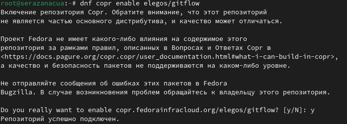
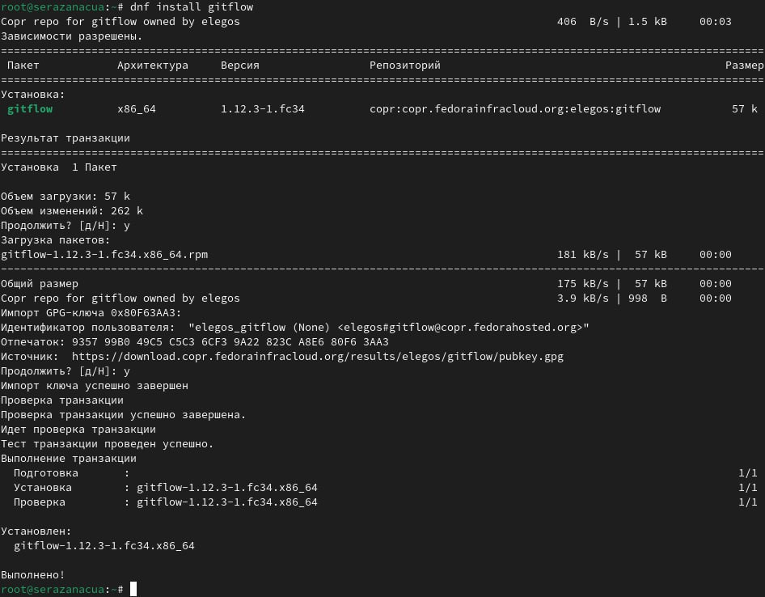
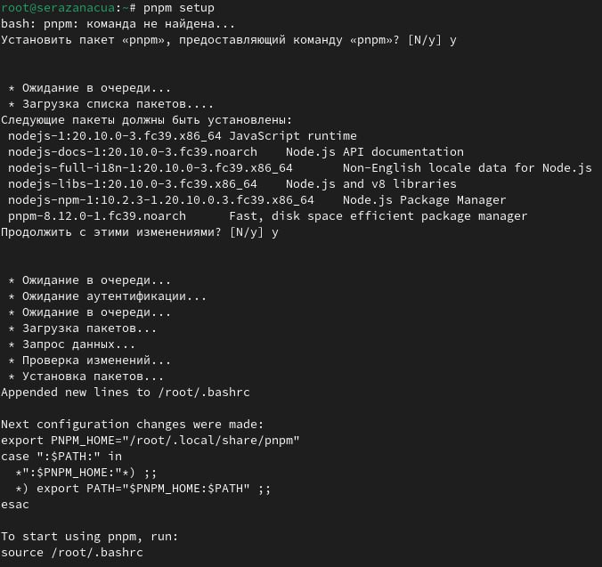
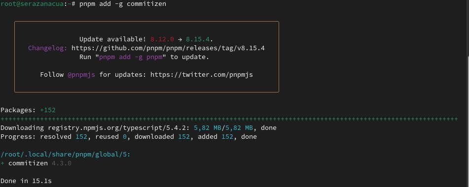
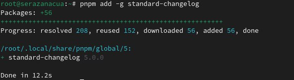
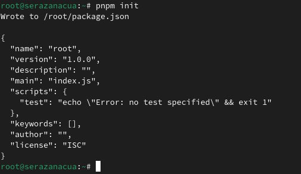
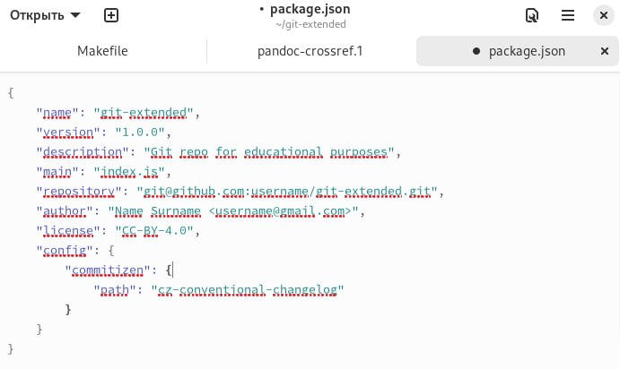
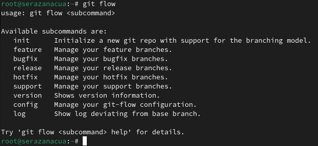

---
## Front matter
lang: ru-RU
title: Лабораторная работа №4
author: |
        Разанацуа Сара Естэлл
        
## i18n babel
babel-lang: russian
babel-otherlangs: english

## i18n babel
babel-lang: russian
babel-otherlangs: english

## Formatting pdf
toc: false
toc-title: Содержание
slide_level: 2
aspectratio: 169
section-titles: true
theme: metropolis
header-includes:
 - \metroset{progressbar=frametitle,sectionpage=progressbar,numbering=fraction}
 - '\makeatletter'
 - '\beamer@ignorenonframefalse'
 - '\makeatother'
---

## Содержание

- Цель работы
- Задание
- Выполнение лабораторной работы
- Список литературы

## Цель

- Получение навыков правильной работы с репозиториями git.

## Задание

- Выполнить работу для тестового репозитория.
- Преобразовать рабочий репозиторий в репозиторий с git-flow и conventional commits.

## Установка программного обеспечения

- Установка git-flow. 

{#fig:001 width=100%}

{#fig:002 width=100%}

## Установка Node.js

- На Node.js базируется программное обеспечение для семантического версионирования и общепринятых коммитов. 

{#fig:003 width=100%}

## Настройка Node.js

- Для работы с Node.js добавим каталог с исполняемыми файлами, устанавливаемыми yarn, в переменную PATH. 

{#fig:004 width=100%}

## Общепринятые коммиты

- Данная программа используется для помощи в форматировании коммитов.

{#fig:006 width=100%}

- Данная программа используется для помощи в создании логов. 

{#fig:005 width=100%}

## Практический сценарий использования git

- Создайте репозиторий на GitHub. Для примера назовём его git-extended. 

{#fig:008 width=100%}

- Конфигурация для пакетов Node.js. 

{#fig:009 width=100%}

- Название пакета.Сконфигурим формат коммитов. 

{#fig:010 width=100%}

- Конфигурация git-flow. 

{#fig:011 width=100%}

## Вывод

- Я изучала как получить навыки правильной работы с репозиториями git.

## Список литературы

## {.standout}

Спасибо за внимание

