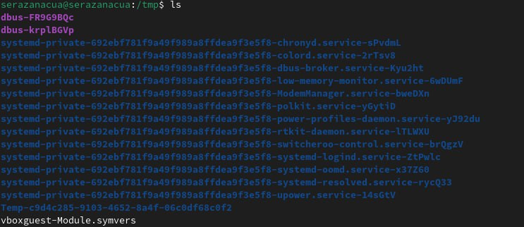
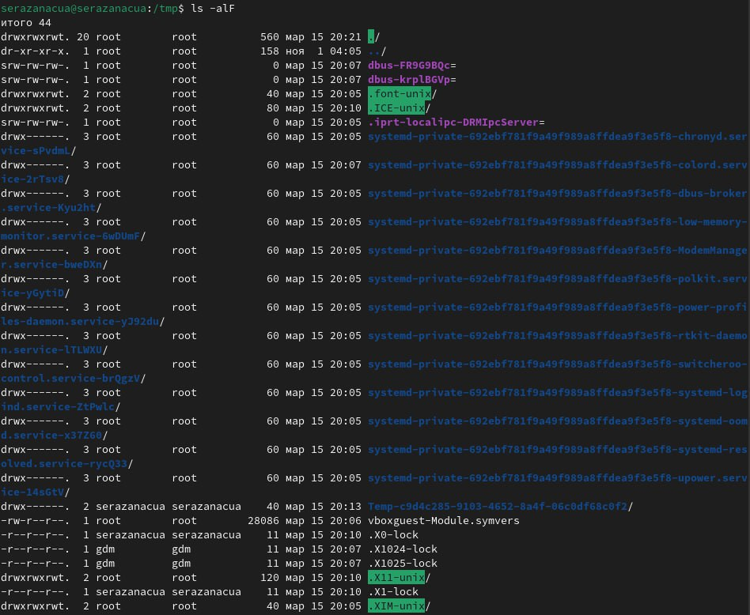
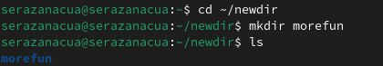
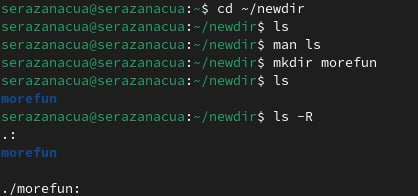

---
## Front matter
lang: ru-RU
title: Лабораторная работа №6
subtitle: "Основы интерфейса взаимодействия пользователя с системой Unix на уровне командной строки"
author: |
         Разанацуа Сара Естэлл
## i18n babel
babel-lang: russian
babel-otherlangs: english

## Formatting pdf
toc: false
toc-title: Содержание
slide_level: 2
aspectratio: 169
section-titles: true
theme: metropolis
header-includes:
 - \metroset{progressbar=frametitle,sectionpage=progressbar,numbering=fraction}
 - '\makeatletter'
 - '\beamer@ignorenonframefalse'
 - '\makeatother'
---

## Содержание

1. Цель
2. Основные задачи
3. Процесс выполнения
4. Вывод
5. Список литературы

## Цель

- Приобретение практических навыков взаимодействия пользователя с системой посредством командной строки.

## Основные задачи

1. Определите полное имя вашего домашнего каталога. Далее относительно этого каталога будут выполняться последующие упражнения.
2. Выполните следующие действия:
3. Выполните следующие действия:
4. С помощью команды man определите, какую опцию команды ls нужно использовать для просмотра содержимое не только указанного каталога, но и подкаталогов,
входящих в него.
5. С помощью команды man определите набор опций команды ls, позволяющий отсортировать по времени последнего изменения выводимый список содержимого каталога
с развёрнутым описанием файлов.
6. Используйте команду man для просмотра описания следующих команд: cd, pwd, mkdir,
rmdir, rm. Поясните основные опции этих команд.
7. Используя информацию, полученную при помощи команды history, выполните модификацию и исполнение нескольких команд из буфера команд.

## Процесс выполнения

1. Определяем полное имя домашнего каталога с помощью команды pwd.(рис. [-@fig:001])

{ #fig:001 width=100% }

## Процесс выполнения

2. Выведем на экран содержимое каталога /tmp с помощью команды ls с различными опциями. (рис. [-@fig:003])

{ #fig:003 width=100% }

Опция -a. (рис. [-@fig:004])

{ #fig:004 width=100% }

## Процесс выполнения

3.  В домашнем каталоге создадим одной командой (mkdir) три новых каталога с именами
letters, memos, misk. Затем удалим эти каталоги одной командой (rmdir). (рис. [-@fig:011])

{ #fig:011 width=80% }

## Процесс выполнения

4. С помощью команды man определим, какую опцию команды ls нужно использовать для просмотра содержимое не только указанного каталога, но и подкаталогов, входящих в него. Узнаем, что это можно сделать с помощью опции -R. (рис. [-@fig:014])

{ #fig:014 width=80% }

## Вывод

- Научилась работать с командной строкой. Изучила различные команды и научилась их применять.

## Список литературы

1. Командная строка Windows [Электронный ресурс]. URL:
https://foxford.ru/wiki/informatika/komandnaya-stroka-windows.

## {.standout}

Спасибо за внимания

