---
## Front matter
title: "Лабораторная работа № 6"
subtitle: "Основы интерфейса взаимодействия пользователя с системой Unix на уровне командной строки"
author: "Разанацуа Сара Естэлл"

## Generic otions
lang: ru-RU
toc-title: "Содержание"

## Bibliography
bibliography: bib/cite.bib
csl: pandoc/csl/gost-r-7-0-5-2008-numeric.csl

## Pdf output format
toc: true # Table of contents
toc-depth: 2
lof: true # List of figures
lot: true # List of tables
fontsize: 12pt
linestretch: 1.5
papersize: a4
documentclass: scrreprt
## I18n polyglossia
polyglossia-lang:
  name: russian
  options:
	- spelling=modern
	- babelshorthands=true
polyglossia-otherlangs:
  name: english
## I18n babel
babel-lang: russian
babel-otherlangs: english
## Fonts
mainfont: PT Serif
romanfont: PT Serif
sansfont: PT Sans
monofont: PT Mono
mainfontoptions: Ligatures=TeX
romanfontoptions: Ligatures=TeX
sansfontoptions: Ligatures=TeX,Scale=MatchLowercase
monofontoptions: Scale=MatchLowercase,Scale=0.9
## Biblatex
biblatex: true
biblio-style: "gost-numeric"
biblatexoptions:
  - parentracker=true
  - backend=biber
  - hyperref=auto
  - language=auto
  - autolang=other*
  - citestyle=gost-numeric
## Pandoc-crossref LaTeX customization
figureTitle: "Рис."
tableTitle: "Таблица"
listingTitle: "Листинг"
lofTitle: "Список иллюстраций"
lotTitle: "Список таблиц"
lolTitle: "Листинги"
## Misc options
indent: true
header-includes:
  - \usepackage{indentfirst}
  - \usepackage{float} # keep figures where there are in the text
  - \floatplacement{figure}{H} # keep figures where there are in the text
---

# Цель работы

- Приобретение практических навыков взаимодействия пользователя с системой посредством командной строки.

# Задание

- 1. Определите полное имя вашего домашнего каталога. Далее относительно этого каталога будут выполняться последующие упражнения.
- 2. Выполните следующие действия:
- 3. Выполните следующие действия:
- 4. С помощью команды man определите, какую опцию команды ls нужно использовать для просмотра содержимое не только указанного каталога, но и подкаталогов,
входящих в него.
- 5. С помощью команды man определите набор опций команды ls, позволяющий отсортировать по времени последнего изменения выводимый список содержимого каталога
с развёрнутым описанием файлов.
- 6. Используйте команду man для просмотра описания следующих команд: cd, pwd, mkdir,
rmdir, rm. Поясните основные опции этих команд.
- 7. Используя информацию, полученную при помощи команды history, выполните модификацию и исполнение нескольких команд из буфера команд.

# Выполнение лабораторной работы

- Определяем полное имя домашнего каталога с помощью команды pwd.(рис. [-@fig:001])

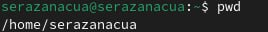{ #fig:001 width=100% }

- Перейдем в каталог /tmp. (рис. [-@fig:002])

{ #fig:002 width=100% }

- Выведем на экран содержимое каталога /tmp с помощью команды ls с различными опциями. (рис. [-@fig:003])

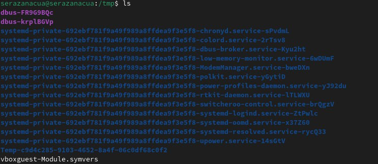{ #fig:003 width=100% }

- Опция -a. (рис. [-@fig:004])

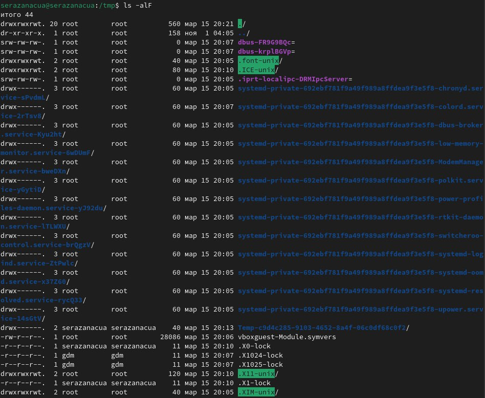{ #fig:004 width=100% }

- Опция -l. (рис. [-@fig:005])

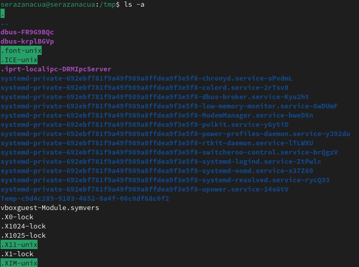{ #fig:005 width=100% }

- Опция -alF . (рис. [-@fig:006])

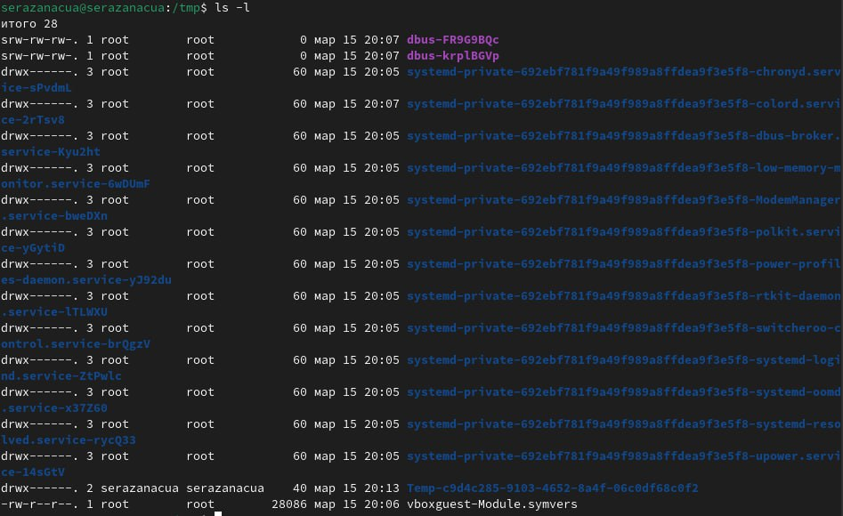{ #fig:006 width=100% }

- Определяем есть ли в каталоге /var/spool подкаталог с именем cron. Видим, что его там нет. (рис. [-@fig:007])

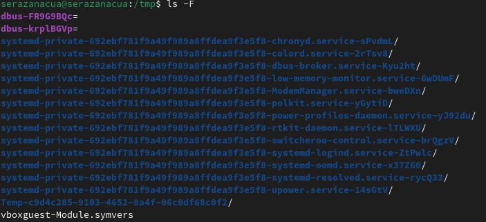{ #fig:007 width=100% }

- Перейдем в домашний каталог и выведем на экран его содержимое. Видим, что владельцем файлов и подкаталогов явялется пользователь pcaladi (то есть я). (рис. [-@fig:008])

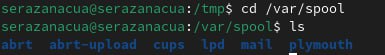{ #fig:008 width=100% }

- В домашнем каталоге создадим новый каталог с именем newdir. (рис. [-@fig:009])

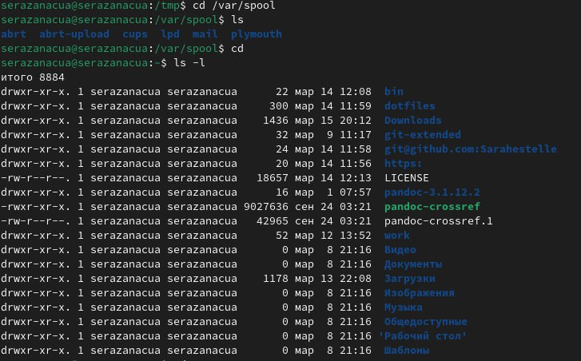{ #fig:009 width=100% }

- В каталоге ~/newdir создадим новый каталог с именем morefun. (рис. [-@fig:010])

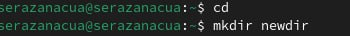{ #fig:010 width=100% }

- В домашнем каталоге создадим одной командой (mkdir) три новых каталога с именами
letters, memos, misk. Затем удалим эти каталоги одной командой (rmdir). (рис. [-@fig:011])

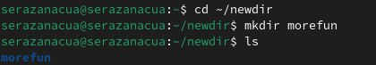{ #fig:011 width=100% }

- Попробуем удалить ранее созданный каталог ~/newdir командой rm. Видим, что терминал выдает ошибку. (рис. [-@fig:012])

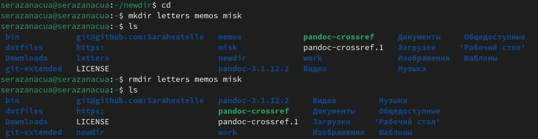{ #fig:012 width=100% }

- Удалим каталог ~/newdir/morefun из домашнего каталога. С помощью команды ls проверяем удалился ли каталог. Видим, что он удалился. (рис. [-@fig:013])

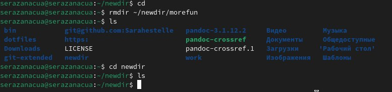{ #fig:013 width=100% }

- С помощью команды man определим, какую опцию команды ls нужно использовать для просмотра содержимое не только указанного каталога, но и подкаталогов, входящих в него. Узнаем, что это можно сделать с помощью опции -R. (рис. [-@fig:014])

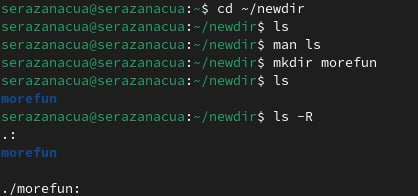{ #fig:014 width=100% }

- С помощью команды man определим набор опций команды ls, позволяющий отсортировать по времени последнего изменения выводимый список содержимого каталогас развёрнутым описанием файлов. Узнаем, что это можно сделать с помощью опции -lt. (рис. [-@fig:015])

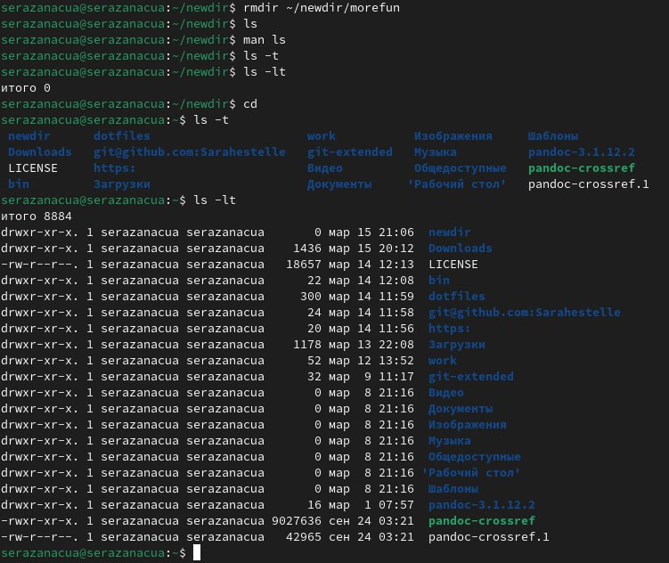{ #fig:015 width=100% }

- Используем команду man для просмотра описания следующих команд: cd: (рис. [-@fig:016])

{ #fig:016 width=100% }

pwd: (рис. [-@fig:017])

{ #fig:017 width=100% }
 
mkdir: (рис. [-@fig:018])

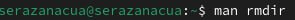{ #fig:018 width=100% }

rmdir: (рис. [-@fig:019])

{ #fig:019 width=100% }
rm: (рис: [-@fig:019])

# Выводы

Научилась работать с командной строкой. Изучила различные команды и научилась их применять.

# Ответы на контрольные вопросы

1. Что такое командная строка?
Командная строка (или «консоль») – это текстовый интерфейс между человеком и компьютером, в котором инструкции компьютеру даются путём ввода с клавиатуры текстовых строк (команд). Интерфейс командной строки противопоставляется управлению программами на основе меню, а также различным реализациям графического интерфейса.
Команды, введённые пользователем, интерпретируются и выполняются специальной
программой — командной оболочкой (или «shell» по-английски).
2. При помощи какой команды можно определить абсолютный путь текущего каталога?
Приведите пример.
Для определения абсолютного пути к текущему каталогу используется
команда pwd (print working directory).
Пример (абсолютное имя текущего каталога пользователя dharma):
(pwd
результат:
/afs/dk.sci.pfu.edu.ru/home/d/h/dharma)
3. При помощи какой команды и каких опций можно определить только тип файлов
и их имена в текущем каталоге? Приведите примеры.
При помощи команды ls -F. 
(ls -F
 install-tl-unx/   newdir/   work/   Видео/   Документы/   Загрузки/   Изображения/   Музыка/   Общедоступные/  'Рабочий стол'/   Шаблоны/)
4. Каким образом отобразить информацию о скрытых файлах? Приведите примеры.
С помощью команды ls -a.
(ls -a
 .               .bash_logout    .cache       .gnupg           .local     .pki           .var                               .vboxclient-draganddrop.pid   .wget-hsts   Документы     Музыка          Шаблоны
 ..              .bash_profile   .config      install-tl-unx   .mozilla   .ssh           .vboxclient-clipboard.pid          .vboxclient-seamless.pid      work         Загрузки      Общедоступные
 .bash_history   .bashrc         .gitconfig   .lesshst         newdir     .texlive2022   .vboxclient-display-svga-x11.pid   .vscode                       Видео        Изображения  'Рабочий стол')
5. При помощи каких команд можно удалить файл и каталог? Можно ли это сделать
одной и той же командой? Приведите примеры.
Команда rm используется для удаления файлов и/или каталогов. Чтобы удалить каталог, содержащий файлы, нужно использовать опцию r. Без указания этой опции команда не будет выполняться (rm -r abc).
Если каталог пуст, то можно воспользоваться командой rmdir. Если удаляемый
каталог содержит файлы, то команда не будет выполнена — нужно использовать rm -
r имя_каталога.
6. Каким образом можно вывести информацию о последних выполненных пользователем командах? работы?
С помощью команды history.
7. Как воспользоваться историей команд для их модифицированного выполнения? Приведите примеры.
Можно модифицировать команду из выведенного на экран списка при помощи следующей конструкции: !<номер_команды>:s/<что_меняем>/<на_что_меняем>
(!3:s/a/F
ls -F)
8. Приведите примеры запуска нескольких команд в одной строке.
Если требуется выполнить последовательно несколько
команд, записанный в одной строке, то для этого используется символ точка с запятой.
(cd; ls)
9. Дайте определение и приведите примера символов экранирования.
Если в заданном контексте встречаются специальные символы (типа «.»,
«/», «*» и т.д.), надо перед ними поставить символ экранирования \ (обратный слэш).
10. Охарактеризуйте вывод информации на экран после выполнения команды ls с опцией
l.
Чтобы вывести на экран подробную информацию о файлах и каталогах, необходимо
использовать опцию l. При этом о каждом файле и каталоге будет выведена следующая
информация:
– тип файла,
– право доступа,
– число ссылок,
– владелец,
– размер,
– дата последней ревизии,
– имя файла или каталога.
11. Что такое относительный путь к файлу? Приведите примеры использования относительного и абсолютного пути при выполнении какой-либо команды.
Относительный путь — это ссылка, указывающая на другие страницы вашего сайта относительно веб-страницы, на которой эта ссылка уже находится.
Пример относительно пути: ./docs/files/file.txt
Пример абсолютного пути:  cd /home/dmbelicheva/work/study
12. Как получить информацию об интересующей вас команде?
С помощью команды hepl.
13. Какая клавиша или комбинация клавиш служит для автоматического дополнения
вводимых команд?
Клавиша Tab.

# Список литературы{.unnumbered}

::: {#refs}
:::

