---
## Front matter
title: "Лабораторная работа № 7"
subtitle: "Анализ файловой системы Linux. Команды для работы с файлами и каталогами"
author: "Разанацуа Сара Естэлл"

## Generic otions
lang: ru-RU
toc-title: "Содержание"

## Bibliography
bibliography: bib/cite.bib
csl: pandoc/csl/gost-r-7-0-5-2008-numeric.csl

## Pdf output format
toc: true # Table of contents
toc-depth: 2
lof: true # List of figures
lot: true # List of tables
fontsize: 12pt
linestretch: 1.5
papersize: a4
documentclass: scrreprt
## I18n polyglossia
polyglossia-lang:
  name: russian
  options:
	- spelling=modern
	- babelshorthands=true
polyglossia-otherlangs:
  name: english
## I18n babel
babel-lang: russian
babel-otherlangs: english
## Fonts
mainfont: PT Serif
romanfont: PT Serif
sansfont: PT Sans
monofont: PT Mono
mainfontoptions: Ligatures=TeX
romanfontoptions: Ligatures=TeX
sansfontoptions: Ligatures=TeX,Scale=MatchLowercase
monofontoptions: Scale=MatchLowercase,Scale=0.9
## Biblatex
biblatex: true
biblio-style: "gost-numeric"
biblatexoptions:
  - parentracker=true
  - backend=biber
  - hyperref=auto
  - language=auto
  - autolang=other*
  - citestyle=gost-numeric
## Pandoc-crossref LaTeX customization
figureTitle: "Рис."
tableTitle: "Таблица"
listingTitle: "Листинг"
lofTitle: "Список иллюстраций"
lotTitle: "Список таблиц"
lolTitle: "Листинги"
## Misc options
indent: true
header-includes:
  - \usepackage{indentfirst}
  - \usepackage{float} # keep figures where there are in the text
  - \floatplacement{figure}{H} # keep figures where there are in the text
---

# Цель работы

- Ознакомление с файловой системой Linux, её структурой, именами и содержанием
каталогов. Приобретение практических навыков по применению команд для работы
с файлами и каталогами, по управлению процессами (и работами), по проверке исполь-
зования диска и обслуживанию файловой системы.

# Задание

- 1. Выполните все примеры
- 2. Выполните следующие действия
- 3. Определите опции команды chmod
- 4. Проделайте приведённые ниже упражнения
- 5. Прочитайте man

# Выполнение лабораторной работы

## Выполнение все примеры

- Копирование файла в текущем каталоге. Скопировать файл ~/abc1 в файл april и в файл may:(рис. [-@fig:001]).

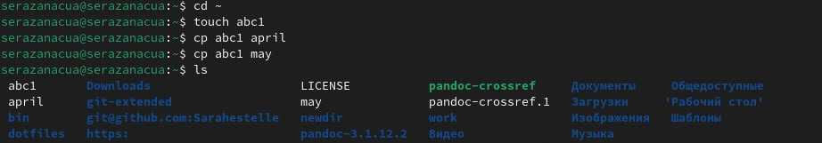{#fig:001 width=100%}

- Копирование нескольких файлов в каталог. Скопировать файлы april и may в каталог monthly: (рис. [-@fig:002]).

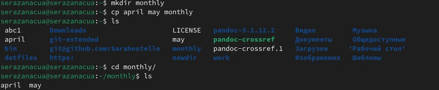{#fig:002 width=100%}

- Копирование файлов в произвольном каталоге. Скопировать файл monthly/may в файл с именем june: (рис. [-@fig:003]).

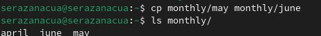{#fig:003 width=100%} 

- Копирование каталогов в текущем каталоге. Скопировать каталог monthly в каталог monthly.00 и monthly.00 в каталог /tmp (рис. [-@fig:004]).

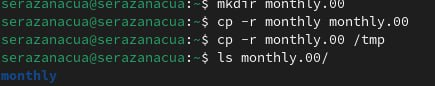{#fig:004 width=100%}

- Переименование файлов в текущем каталоге. Изменить название файла april на july в домашнем каталоге: (рис. [-@fig:005]).

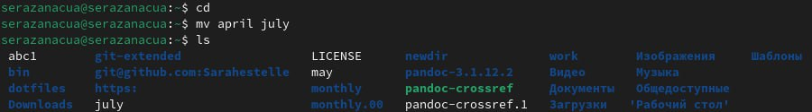{#fig:005 width=100%}

- Перемещение файлов в другой каталог. Переместить файл july в каталог monthly.00:  (рис. [-@fig:006]).

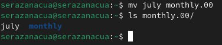{#fig:006 width=100%}
 
- Перемещение каталога в другой каталог. Переместить каталог monthly.01в каталог reports: (рис. [-@fig:008]).

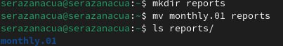{#fig:008 width=100%}

- Переименование каталога, не являющегося текущим. Переименовать каталог reports/monthly.01 в reports/monthly: (рис. [-@fig:009]).

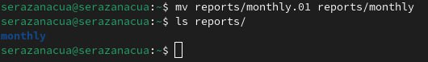{#fig:009 width=100%}

- Изменение прав доступа. Требуется создать файл ~/may с правом выполнения для владельца: (рис. [-@fig:010]).

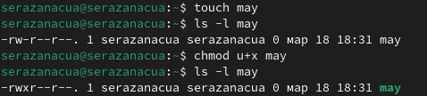{#fig:010 width=100%}

- Требуется лишить владельца файла ~/may права на выполнение:  (рис. [-@fig:011]).

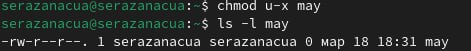{#fig:011 width=100%}

- Требуется создать каталог monthly с запретом на чтение для членов группы и всех остальных пользователей:  (рис. [-@fig:012]).

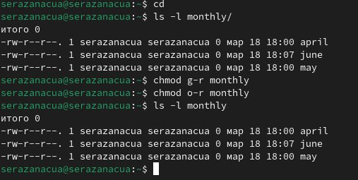{#fig:012 width=100%}

- Требуется создать файл ~/abc1 с правом записи для членов группы:  (рис. [-@fig:013]).

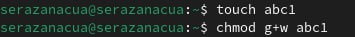{#fig:013 width=100%}

## Выполнение следующего действия

- Скопируем файл /usr/include/sys/io.h в домашний каталог и название его equipment. Если файла io.h нет, то используйте любой другой файл в каталоге /usr/include/sys/ вместо него. (рис. [-@fig:014]).

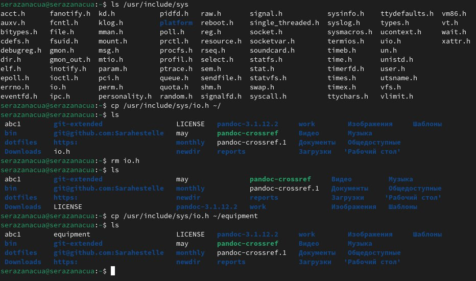{#fig:014 width=100%}

- В домашнем каталоге, создаём директорию ~/ski.plases. (рис. [-@fig:015]).

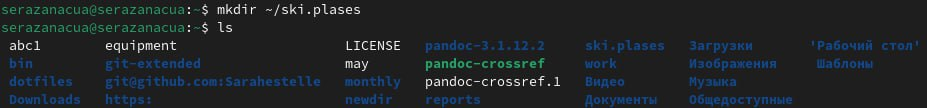{#fig:015 width=100%}

- Перемены файла equipment в каталог ~/ski.plases. (рис. [-@fig:016]).

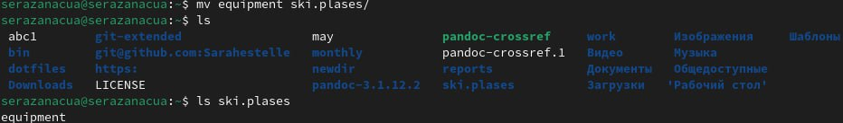{#fig:016 width=100%}

-  Переименование файла ~/ski.plases/equipment в ~/ski.plases/equiplist. (рис. [-@fig:017]).

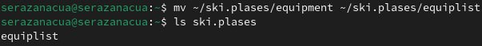{#fig:017 width=100%}

- Создаём в домашнем каталоге файл abc1 и скопируем его в каталог ~/ski.plases, назовите его equiplist2. (рис. [-@fig:018]).

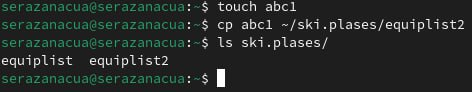{#fig:018 width=100%}

- Создаём каталог с именем equipment в каталоге ~/ski.plases. И перемены файлов ~/ski.plases/equiplist и equiplist2 в каталог ~/ski.plases/equipment. (рис. [-@fig:019]).

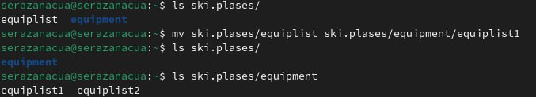{#fig:019 width=100%}

- Создание и перемены каталога ~/newdir в каталог ~/ski.plases и название его plans. (рис. [-@fig:020]).

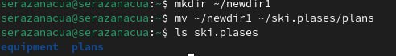{#fig:020 width=100%}

## Определите опции команды chmod

- (рис. [-@fig:023]).

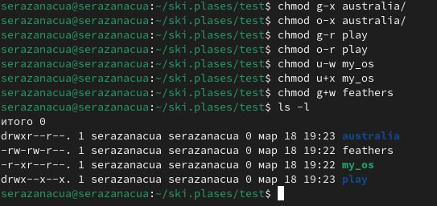{#fig:023 width=100%}

## Проделать приведённые ниже упражнения

- Просмотр содержимого файла /etc/password.  (рис. [-@fig:024]).

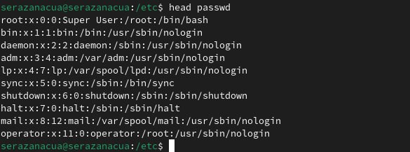{#fig:024 width=100%}

- Скопируем файл ~/feathers в файл ~/file.old. (рис. [-@fig:025]).

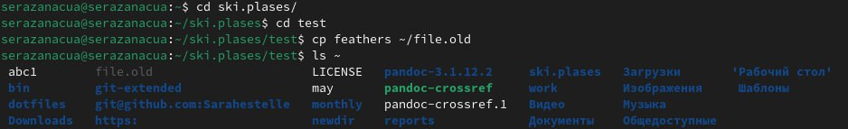{#fig:025 width=100%}

-  Перемены файл ~/file.old в каталог ~/play.  (рис. [-@fig:026]).

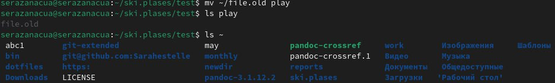{#fig:026 width=100%}

- Перемены файла ~/file.old в каталог ~/play. Скопируем каталог ~/play в каталог ~/fun. Перемены каталога ~/fun в каталог ~/play и назовите его games. Лишение владельца файла ~/feathers права на чтение.  (рис. [-@fig:027]).

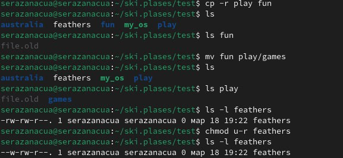{#fig:027 width=100%}

## Прочитайте man

- Прочитайте man по командам mount, fsck, mkfs, kill и кратко их охарактеризуйте, приведя примеры.  (рис. [-@fig:028]).

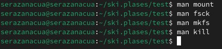{#fig:028 width=100%}

# Выводы

- Ознакомилась с файловой системой Linux и с ее структурой. Научилась использовать различные команды в терминале для работы с файлами и каталогами.

# Список литературы{.unnumbered}

::: {#refs}
:::
