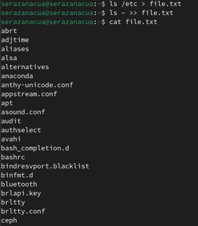
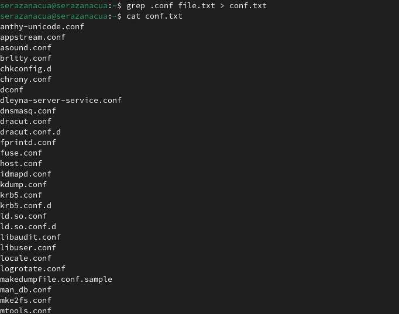
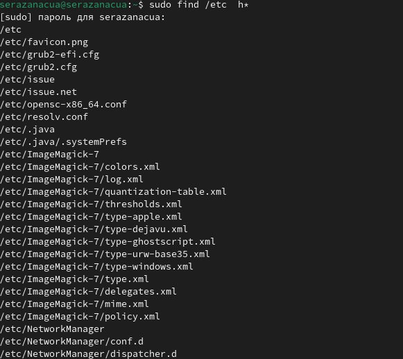
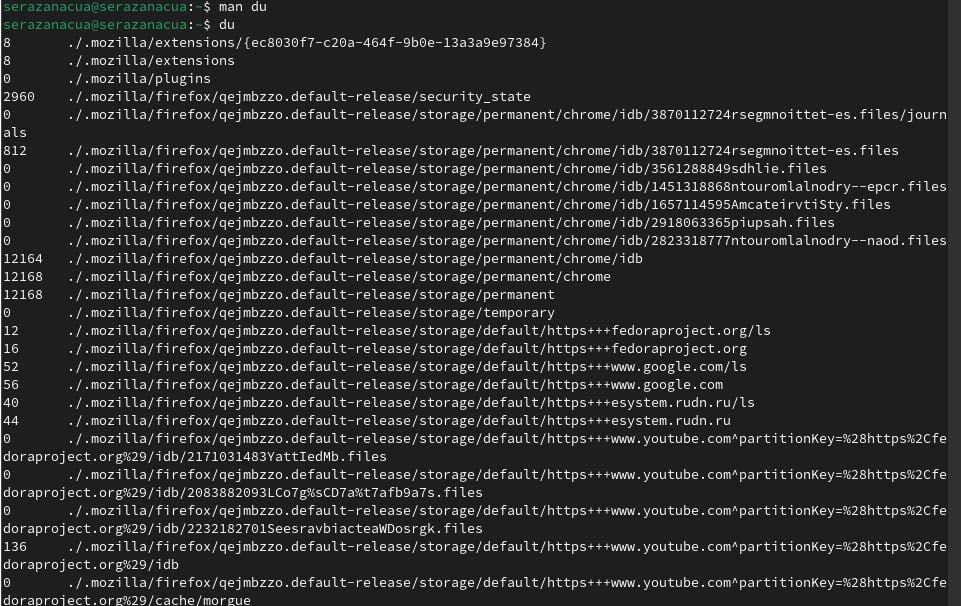

---
## Front matter
lang: ru-RU
title: Лабораторная работа №8
subtitle: "Поиск файлов. Перенаправление ввода-вывода. Просмотр запущенных процессов"
author: |
         Разанацуа Сара Естэлл
## i18n babel
babel-lang: russian
babel-otherlangs: english

## Formatting pdf
toc: false
toc-title: Содержание
slide_level: 2
aspectratio: 169
section-titles: true
theme: metropolis
header-includes:
 - \metroset{progressbar=frametitle,sectionpage=progressbar,numbering=fraction}
 - '\makeatletter'
 - '\beamer@ignorenonframefalse'
 - '\makeatother'
---

## Содержание

1. Цель работы
2. Выполнение работы
3. Выводы 

## Цель работы

- Ознакомление с инструментами поиска файлов и фильтрации текстовых данных. Приобретение практических навыков: по управлению процессами (и заданиями), по проверке использования диска и обслуживанию файловых систем.

## Процесс выполнения

- Запишем в файл file.txt названия файлов, содержащихся в каталоге /etc. Допишем  в этот же файл названия файлов, содержащихся в вашем домашнем каталоге.

{#fig:001 width=100%}

## Процесс выполнения

- Выводим имена всех файлов из file.txt, имеющих расширение .conf, после чего запишем их в новый текстовой файл conf.txt.

{#fig:002 width=100%}

## Процесс выполнения

- Выводим на экран (по странично) имена файлов из каталога /etc, начинающиеся с символа h. 

{#fig:004 width=100%}

## Процесс выполнения

- Запустим в фоновом режиме процесс, который будет записывать в файл ~/logfile файлы, имена которых начинаются с log. 

{#fig:005 width=100%}

## Процесс выполнения

- Удалим файл ~/logfile. 

{#fig:006 width=100%}

## Процесс выполнения

- Запустим из консоли в фоновом режиме редактор gedit.

{#fig:007 width=100%}

## Процесс выполнения

- Прочитаем справку (man) команды kill, после чего используйте её для завершения процесса gedit.

{#fig:010 width=100%}

## Процесс выполнения

- Выполняем команды df и du, предварительно получив более подробную информацию об этих командах, с помощью команды man.

{#fig:011 width=100%}

{#fig:012 width=100%}

## Процесс выполнения

- Воспользуемся справкой команды find, выведите имена всех директорий, имеющихся в вашем домашнем каталоге.

{#fig:013 width=100%}

## Выводы

- В процессе выполнения лабораторной работы ознакомилась с инструментами поиска файлов и фильтрации текстовых данных. Приобрела практические навыки: по управлению процессами (и заданиями), по проверке использования диска и обслуживанию файловых систем.

## Список литературы

1. Командная строка Windows [Электронный ресурс]. URL:
https://foxford.ru/wiki/informatika/komandnaya-stroka-windows.

## {.standout}

Спасибо за внимания

