---
## Front matter
lang: ru-RU
title: Лабораторная работа №9
subtitle: "Командная оболочка Midnight Commander"
author: |
         Разанацуа Сара Естэлл
## i18n babel
babel-lang: russian
babel-otherlangs: english

## Formatting pdf
toc: false
toc-title: Содержание
slide_level: 2
aspectratio: 169
section-titles: true
theme: metropolis
header-includes:
 - \metroset{progressbar=frametitle,sectionpage=progressbar,numbering=fraction}
 - '\makeatletter'
 - '\beamer@ignorenonframefalse'
 - '\makeatother'
---

## Содержание

1. Цель работы
2. Выполнение работы
3. Выводы 

## Цель работы

- Освоение основных возможностей командной оболочки Midnight Commander. Приобретение навыков практической работы по просмотру каталогов и файлов; манипуляций с ними.

## Задание по mc

1. Изучим информацию о mc, вызвав в командной строке man mc. 

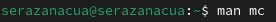{ #fig:001 width=100% }

## Процесс выполнение  

2. Запустим из командной строки mc, изучим его структуру и меню. 

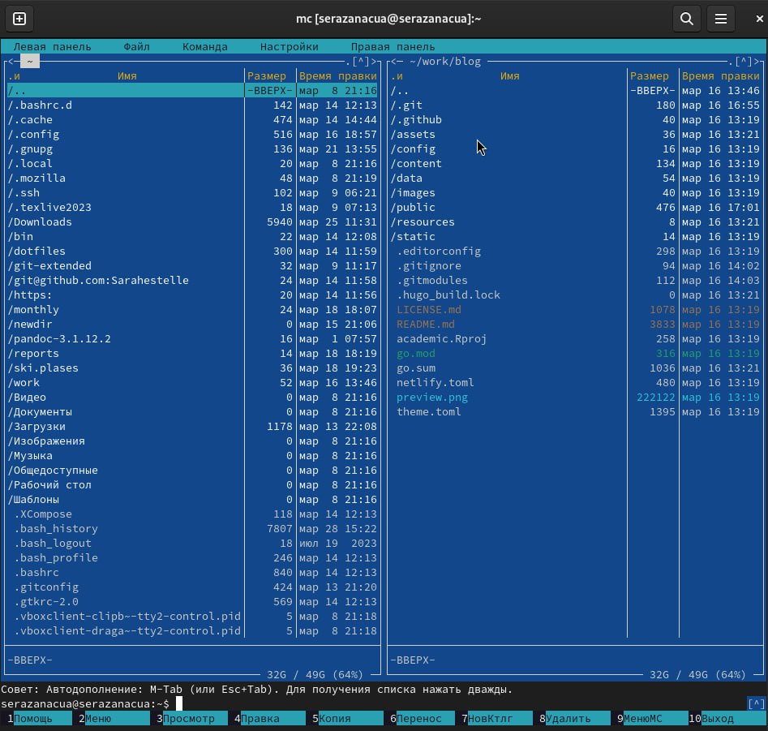{ #fig:002 width=100% }

## Процесс выполнение 

3. Выполним основные команды меню левой (или правой) панели. Оцениv степень подробности вывода информации о файлах. 

{ #fig:004 width=100% }

## Процесс выполнение 

4. Используя возможности подменю Файл , выполним:
– просмотр содержимого текстового файла;
– редактирование содержимого текстового файла (без сохранения результатов редактирования);
– создание каталога;
– копирование файлов в созданный каталог. 

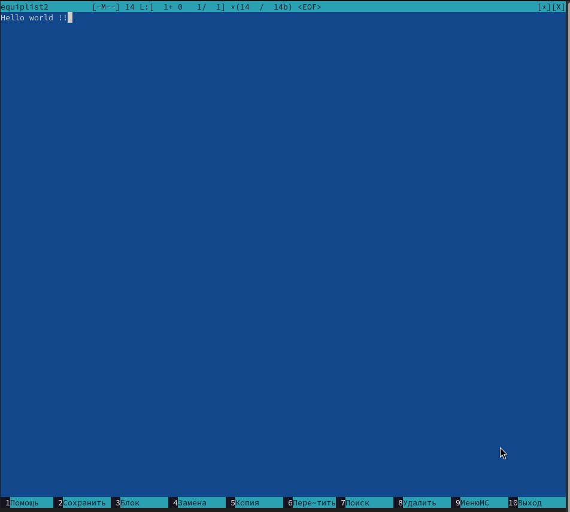{ #fig:005 width=100% }

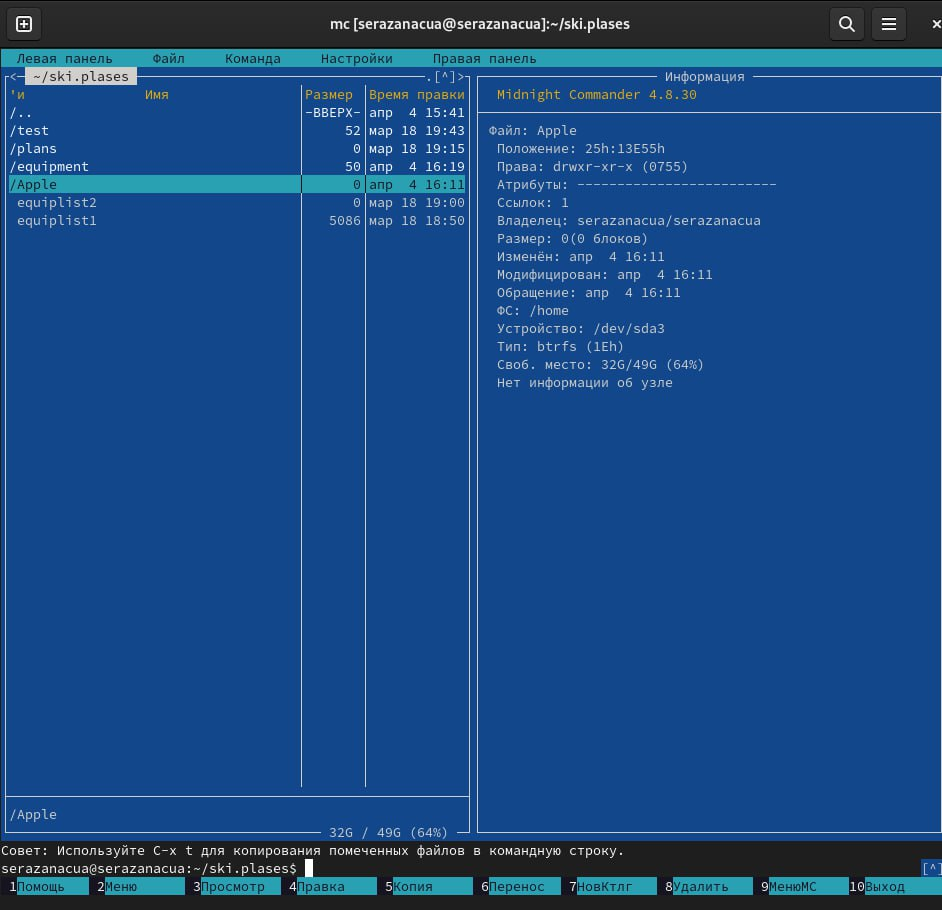{ #fig:006 width=100% }

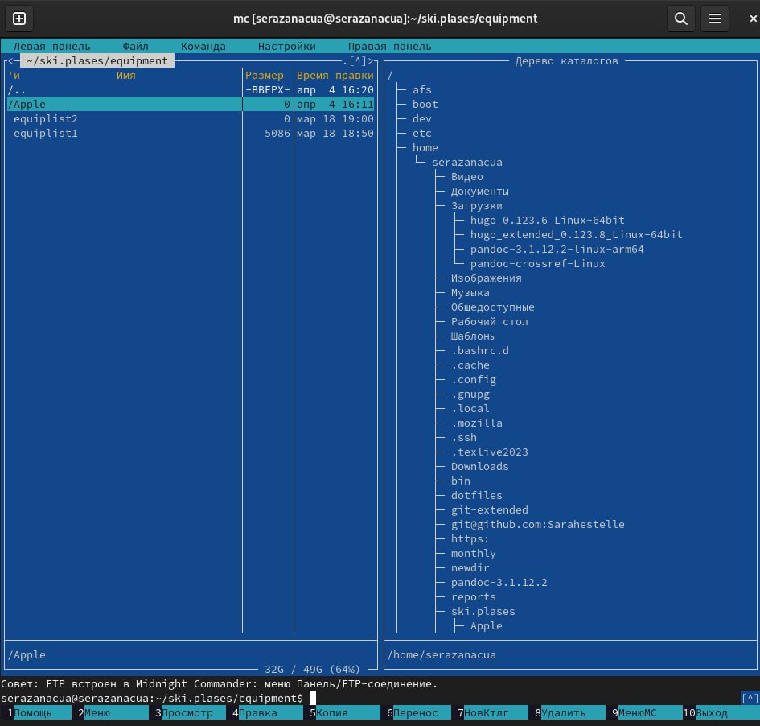{ #fig:007 width=100% }

## Процесс выполнение 

5. С помощью соответствующих средств подменю Команда осуществим:
- поиск в файловой системе файла с заданными условиями (например, файла с расширением .c или .cpp, содержащего строку main);
- выбор и повторение одной из предыдущих команд;
- переход в домашний каталог;
- анализ файла меню и файла расширений. 

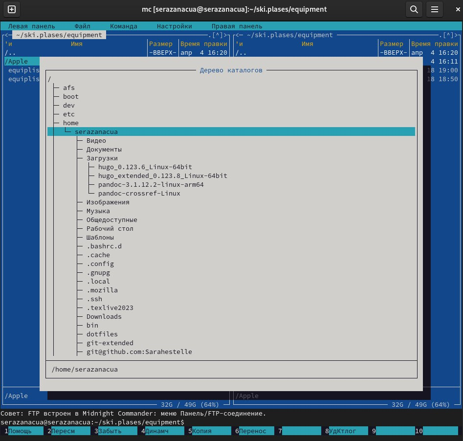{ #fig:008 width=100% }

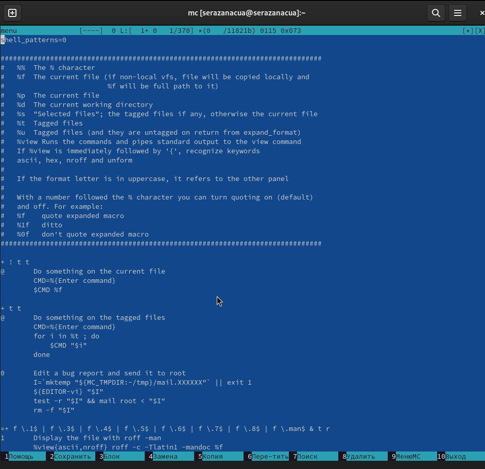{ #fig:009 width=100% }

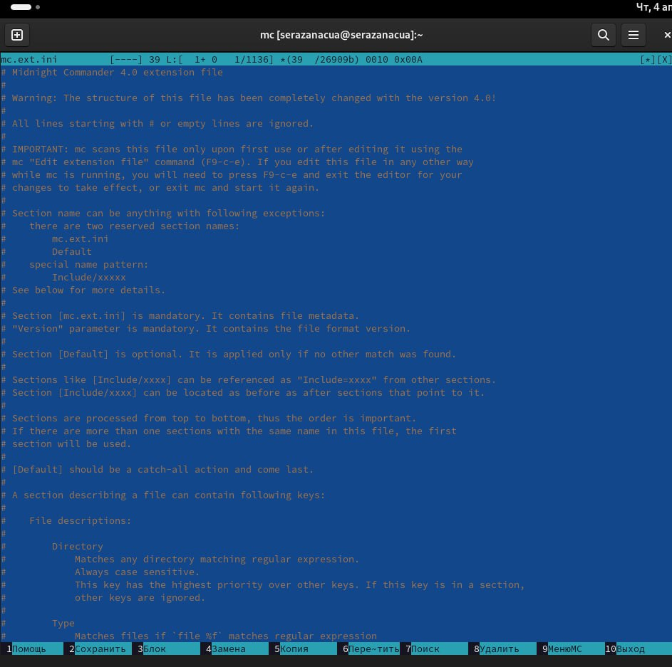{ #fig:010 width=100% }

## Процесс выполнение 

6. Вызовим подменю Настройки. Освоим операции, определяющие структуру экрана mc. 

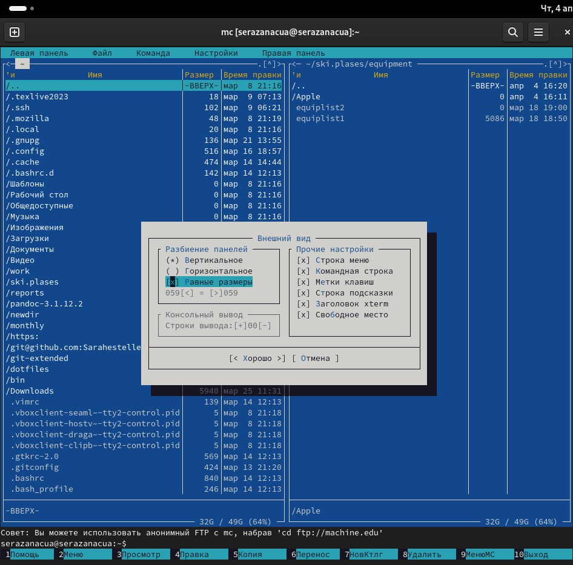{ #fig:011 width=100% }

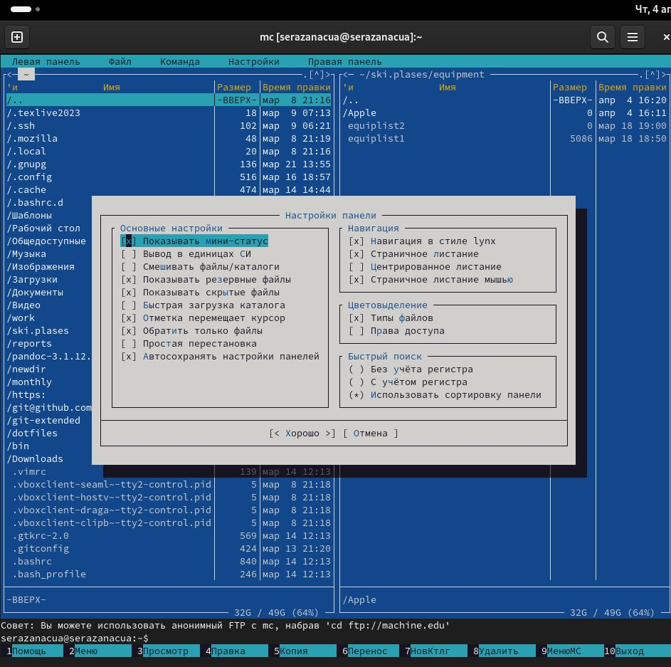{ #fig:012 width=100% }

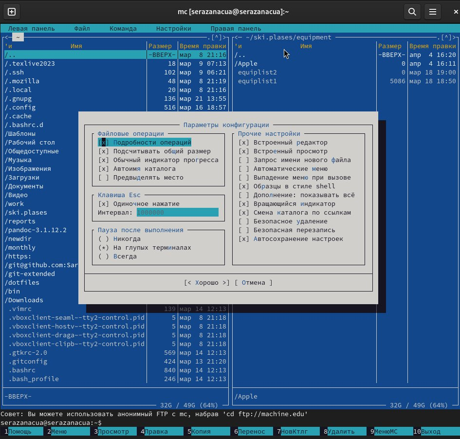{ #fig:013 width=100% }

## Задание по встроенному редактору mc:

1. Создадим текстовой файл text.txt.
2. Откроем этот файл с помощью встроенного в mc редактора.
3. Вставим в открытый файл небольшой фрагмент текста, скопированный из любого другого файла или Интернета.

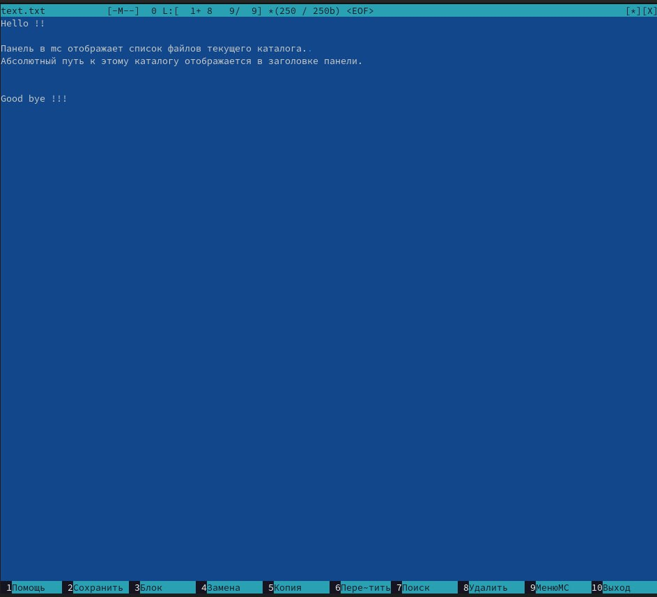{ #fig:014 width=100% }

## Процесс выполнение 

4. Проделаем с текстом следующие манипуляции, используя горячие клавиши:
- Удалим строку текста.
- Выделим фрагмент текста и скопируем его на новую строку.
- Выделим фрагмент текста и перенесем его на новую строку.
- Сохраним файл.
- Отменим последнее действие.
- Перейдем в конец файла (нажав комбинацию клавиш) и напишем некоторый текст.
- Перейдем в начало файла (нажав комбинацию клавиш) и напишем некоторый текст.
- Сохраним и закроем файл.
 
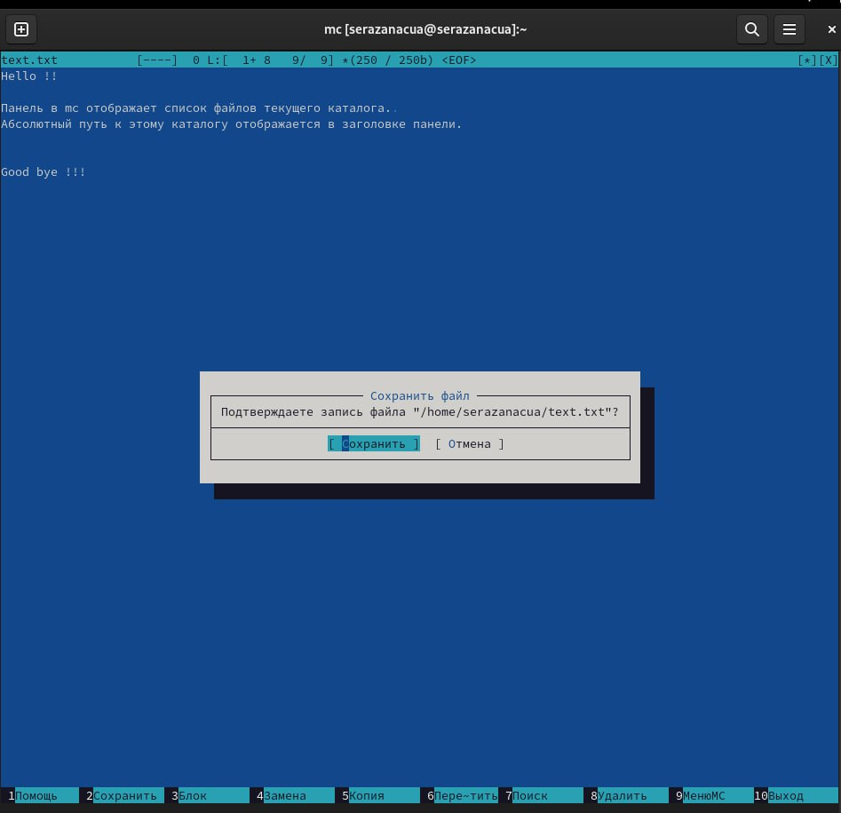{ #fig:015 width=100% }

## Выводы

- В процессе выполнения лабораторной работы я освоила работу с командной оболочкой mc. Приобрела практические навыки работы по просмотру каталогов и файлов и по манипуляции с ними.

## Список литературы

1. Командная строка Windows [Электронный ресурс]. URL:
https://foxford.ru/wiki/informatika/komandnaya-stroka-windows.

## {.standout}

Спасибо за внимания

