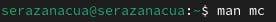

---
## Front matter
title: "Лабораторная работа № 9"
subtitle: "Командная оболочка Midnight Commander"
author: "Разанацуа Сара Естэлл"

## Generic otions
lang: ru-RU
toc-title: "Содержание"

## Bibliography
bibliography: bib/cite.bib
csl: pandoc/csl/gost-r-7-0-5-2008-numeric.csl

## Pdf output format
toc: true # Table of contents
toc-depth: 2
lof: true # List of figures
lot: true # List of tables
fontsize: 12pt
linestretch: 1.5
papersize: a4
documentclass: scrreprt
## I18n polyglossia
polyglossia-lang:
  name: russian
  options:
	- spelling=modern
	- babelshorthands=true
polyglossia-otherlangs:
  name: english
## I18n babel
babel-lang: russian
babel-otherlangs: english
## Fonts
mainfont: PT Serif
romanfont: PT Serif
sansfont: PT Sans
monofont: PT Mono
mainfontoptions: Ligatures=TeX
romanfontoptions: Ligatures=TeX
sansfontoptions: Ligatures=TeX,Scale=MatchLowercase
monofontoptions: Scale=MatchLowercase,Scale=0.9
## Biblatex
biblatex: true
biblio-style: "gost-numeric"
biblatexoptions:
  - parentracker=true
  - backend=biber
  - hyperref=auto
  - language=auto
  - autolang=other*
  - citestyle=gost-numeric
## Pandoc-crossref LaTeX customization
figureTitle: "Рис."
tableTitle: "Таблица"
listingTitle: "Листинг"
lofTitle: "Список иллюстраций"
lotTitle: "Список таблиц"
lolTitle: "Листинги"
## Misc options
indent: true
header-includes:
  - \usepackage{indentfirst}
  - \usepackage{float} # keep figures where there are in the text
  - \floatplacement{figure}{H} # keep figures where there are in the text
---

# Цель работы

- Освоение основных возможностей командной оболочки Midnight Commander. Приобретение навыков практической работы по просмотру каталогов и файлов; манипуляций с ними.

# Задание

## Задание по mc
1. Изучите информацию о mc, вызвав в командной строке man mc.
2. Запустите из командной строки mc, изучите его структуру и меню.
3. Выполните несколько операций в mc, используя управляющие клавиши (операции с панелями; выделение/отмена выделения файлов, копирование/перемещение файлов, получение информации о размере и правах доступа на файлы и/или каталоги и т.п.)
4. Выполните основные команды меню левой (или правой) панели. Оцените степеньподробности вывода информации о файлах.
 5. Используя возможности подменю Файл , выполните:
– просмотр содержимого текстового файла;
– редактирование содержимого текстового файла (без сохранения результатов редактирования);
– создание каталога;
– копирование в файлов в созданный каталог.
6. С помощью соответствующих средств подменю Команда осуществите:
– поиск в файловой системе файла с заданными условиями (например, файла с расширением .c или .cpp, содержащего строку main);
– выбор и повторение одной из предыдущих команд;
– переход в домашний каталог;
– анализ файла меню и файла расширений.
7. Вызовите подменю Настройки . Освойте операции, определяющие структуру экрана mc (Full screen, Double Width, Show Hidden Files и т.д.)

## Задание по встроенному редактору mc

1. Создайте текстовой файл text.txt.
2. Откройте этот файл с помощью встроенного в mc редактора.
3. Вставьте в открытый файл небольшой фрагмент текста, скопированный из любого другого файла или Интернета.
4. Проделайте с текстом следующие манипуляции, используя горячие клавиши:
5. Откройте файл с исходным текстом на некотором языке программирования (например C или Java)
6. Используя меню редактора, включите подсветку синтаксиса, если она не включена, или выключите, если она включена.

# Выполнение лабораторной работы

Задание по mc:
1. Изучим информацию о mc, вызвав в командной строке man mc. (рис. [-@fig:001])

{ #fig:001 width=100% }

2. Запустим из командной строки mc, изучим его структуру и меню. (рис. [-@fig:002])

{ #fig:002 width=100% }

3. Выполним несколько операций в mc, используя управляющие клавиши (операции с панелями; выделение/отмена выделения файлов, копирование/перемещение файлов, получение информации о размере и правах доступа на файлы и/или каталоги и т.п.) (рис. [-@fig:003])

{ #fig:003 width=100% }

4. Выполним основные команды меню левой (или правой) панели. Оцениv степень подробности вывода информации о файлах. (рис. [-@fig:004])

{ #fig:004 width=100% }

5. Используя возможности подменю Файл , выполним:
– просмотр содержимого текстового файла;
– редактирование содержимого текстового файла (без сохранения результатов редактирования);
– создание каталога;
– копирование файлов в созданный каталог. (рис. [-@fig:005;-@fig:006;-@fig:007])

{ #fig:005 width=100% }

{ #fig:006 width=100% }

{ #fig:007 width=100% }

6. С помощью соответствующих средств подменю Команда осуществим:
- поиск в файловой системе файла с заданными условиями (например, файла с расширением .c или .cpp, содержащего строку main);
- выбор и повторение одной из предыдущих команд;
- переход в домашний каталог;
- анализ файла меню и файла расширений. (рис. [-@fig:008;-@fig:009;-@fig:010])

{ #fig:008 width=100% }

{ #fig:009 width=100% }

{ #fig:010 width=100% }

7. Вызовим подменю Настройки. Освоим операции, определяющие структуру экрана mc (Full screen, Double Width, Show Hidden Files и т.д.) (рис. [-@fig:011;-@fig:012;-@fig:013])

{ #fig:011 width=100% }

{ #fig:012 width=100% }

{ #fig:013 width=100% }

Задание по встроенному редактору mc:
1. Создадим текстовой файл text.txt.
2. Откроем этот файл с помощью встроенного в mc редактора.
3. Вставим в открытый файл небольшой фрагмент текста, скопированный из любого другого файла или Интернета.
(рис. [-@fig:014])

{ #fig:014 width=100% }

4. Проделаем с текстом следующие манипуляции, используя горячие клавиши:
- Удалим строку текста.
- Выделим фрагмент текста и скопируем его на новую строку.
- Выделим фрагмент текста и перенесем его на новую строку.
- Сохраним файл.
- Отменим последнее действие.
- Перейдем в конец файла (нажав комбинацию клавиш) и напишем некоторый текст.
- Перейдем в начало файла (нажав комбинацию клавиш) и напишем некоторый текст.
- Сохраним и закроем файл.
 (рис. [-@fig:015])
 
{ #fig:015 width=100% }

# Выводы

- В процессе выполнения лабораторной работы я освоила работу с командной оболочкой mc. Приобрела практические навыки работы по просмотру каталогов и файлов и по манипуляции с ними.

# Список литературы{.unnumbered}

::: {#refs}
:::

