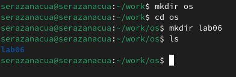
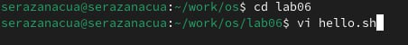
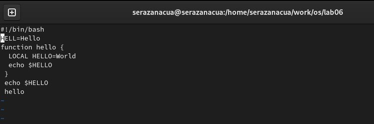
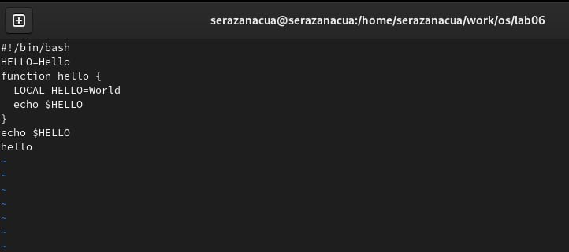
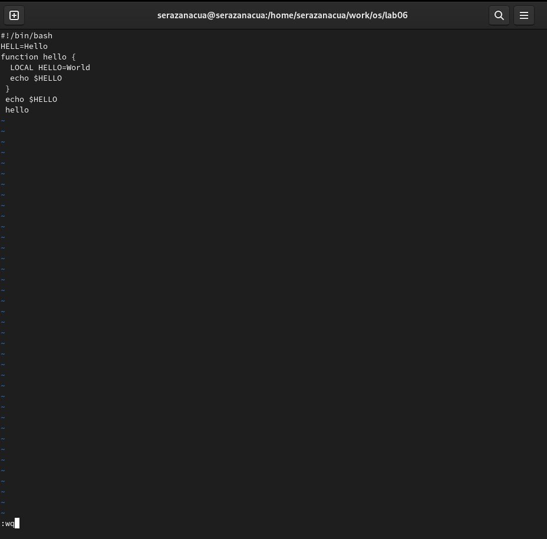
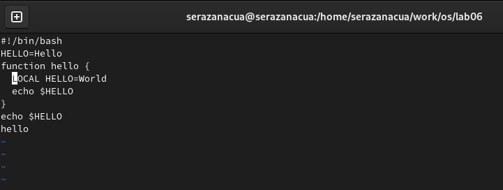
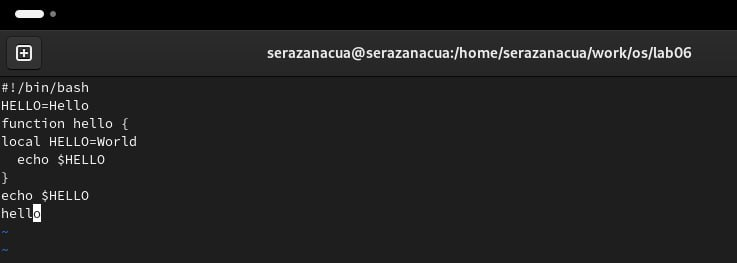
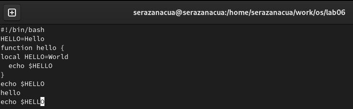
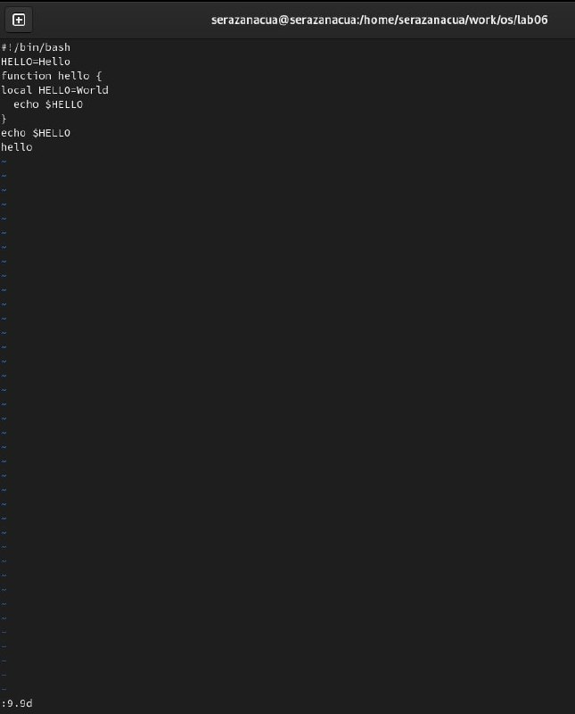
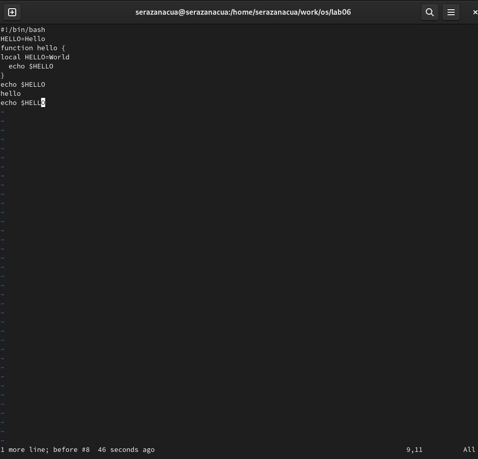

---
## Front matter
lang: ru-RU
title: Лабораторная работа № 10
subtitle: "Текстовой редактор vi"
author: |
         Разанацуа Сара Естэлл
## i18n babel
babel-lang: russian
babel-otherlangs: english

## Formatting pdf
toc: false
toc-title: Содержание
slide_level: 2
aspectratio: 169
section-titles: true
theme: metropolis
header-includes:
 - \metroset{progressbar=frametitle,sectionpage=progressbar,numbering=fraction}
 - '\makeatletter'
 - '\beamer@ignorenonframefalse'
 - '\makeatother'
---

## Цель работы

- Познакомиться с операционной системой Linux. Получить практические навыки работы с редактором vi, установленным по умолчанию практически во всех дистрибутивах.

## Задание

1. Создание нового файла с использованием vi
2. Редактирование существующего файла

## Процесс выполнения

- Создание каталог с именем ~/work/os/lab06. И мы переходим во вновь созданный каталог. Вызовите vi и создайте файл hello.sh.

{ #fig:002 width=50% }

{ #fig:003 width=50% }

## Процесс выполнения

- Нажмите клавишу Esc для перехода в командный режим после завершения ввода текста. Нажмите : для перехода в режим последней строки и внизу вашего экрана появится приглашение в виде двоеточия. Нажмите w (записать) и q (выйти), а затем нажмите клавишу Enter для сохранения вашего текста и завершения работы.

{ #fig:005 width=50% }

##  Редактирование существующего файла

- Вызовите vi на редактирование файла. Установите курсор в конец слова HELL второй строки. И переходим в режим вставки и замените на HELLO. Нажмите Esc для возврата в командный режим. 

{ #fig:008 width=50% }

## Процесс выполнения

- Выводим на экран (по странично) имена файлов из каталога /etc, начинающиеся с символа h. 

{#fig:004 width=100%}

## Процесс выполнения

- Установим курсор на четвертую строку и сотрите слово LOCAL. 

{ #fig:009 width=50% }

## Процесс выполнения

- Установим курсор на последней строке файла. Вставьте после неё строку, содержащую следующий текст: echo $HELLO. 

{ #fig:010 width=50% }

{ #fig:011 width=50% }

## Процесс выполнения

- Удалим последнюю строку.

{ #fig:012 width=50% }

## Процесс выполнения

- Введите команду отмены изменений u для отмены последней команды.

{ #fig:013 width=50% }

## Выводы

- В процессе выполнения лабораторной работы я познакомилась с операционной системой Linux. Получила практические навыки работы с редактором vi, установленным по умолчанию практически во всех дистрибутивах.

## Список литературы

1. Командная строка Windows [Электронный ресурс]. URL:
https://foxford.ru/wiki/informatika/komandnaya-stroka-windows.

## {.standout}

Спасибо за внимания

