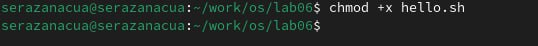
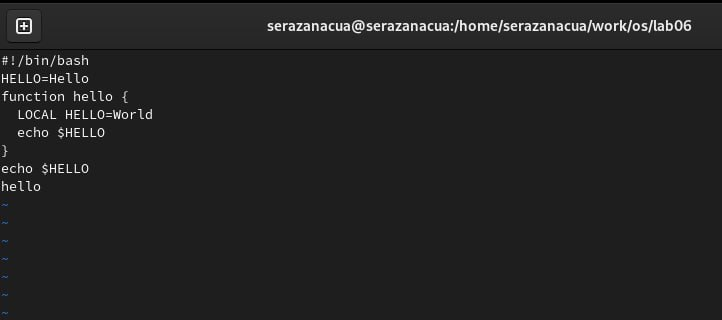

---
## Front matter
title: "Лабораторная работа № 10"
subtitle: "Текстовой редактор vi"
author: "Разанацуа Сара Естэлл"

## Generic otions
lang: ru-RU
toc-title: "Содержание"

## Bibliography
bibliography: bib/cite.bib
csl: pandoc/csl/gost-r-7-0-5-2008-numeric.csl

## Pdf output format
toc: true # Table of contents
toc-depth: 2
lof: true # List of figures
lot: true # List of tables
fontsize: 12pt
linestretch: 1.5
papersize: a4
documentclass: scrreprt
## I18n polyglossia
polyglossia-lang:
  name: russian
  options:
	- spelling=modern
	- babelshorthands=true
polyglossia-otherlangs:
  name: english
## I18n babel
babel-lang: russian
babel-otherlangs: english
## Fonts
mainfont: PT Serif
romanfont: PT Serif
sansfont: PT Sans
monofont: PT Mono
mainfontoptions: Ligatures=TeX
romanfontoptions: Ligatures=TeX
sansfontoptions: Ligatures=TeX,Scale=MatchLowercase
monofontoptions: Scale=MatchLowercase,Scale=0.9
## Biblatex
biblatex: true
biblio-style: "gost-numeric"
biblatexoptions:
  - parentracker=true
  - backend=biber
  - hyperref=auto
  - language=auto
  - autolang=other*
  - citestyle=gost-numeric
## Pandoc-crossref LaTeX customization
figureTitle: "Рис."
tableTitle: "Таблица"
listingTitle: "Листинг"
lofTitle: "Список иллюстраций"
lotTitle: "Список таблиц"
lolTitle: "Листинги"
## Misc options
indent: true
header-includes:
  - \usepackage{indentfirst}
  - \usepackage{float} # keep figures where there are in the text
  - \floatplacement{figure}{H} # keep figures where there are in the text
---

# Цель работы

- Познакомиться с операционной системой Linux. Получить практические навыки работы с редактором vi, установленным по умолчанию практически во всех дистрибутивах.

# Задание

1. Создание нового файла с использованием vi
2. Редактирование существующего файла

# Выполнение лабораторной работы

## Последовательность выполнения работы

- Ознакомимся с теоретическим материалом.
- Ознакомимся с редактором vi. (рис. [-@fig:001])
- Выполнение упражнения, используя команды vi.

{ #fig:001 width=100% }

## Создание нового файла с использованием vi.

- Создание каталог с именем ~/work/os/lab06. И мы переходим во вновь созданный каталог. Вызовите vi и создайте файл hello.sh. (рис. [-@fig:002;-@fig:003])

{ #fig:002 width=100% }

{ #fig:003 width=100% }

- Нажмить клавишу i и вводите следующий текст. (рис. [-@fig:004])

{ #fig:004 width=100% }

- Нажмите клавишу Esc для перехода в командный режим после завершения ввода текста. Нажмите : для перехода в режим последней строки и внизу вашего экрана появится приглашение в виде двоеточия. Нажмите w (записать) и q (выйти), а затем нажмите клавишу Enter для сохранения вашего текста и завершения работы. (рис. [-@fig:005])

{ #fig:005 width=100% }

- Сделаем файл исполняемым (рис. [-@fig:006;-@fig:007])

{ #fig:006 width=100% }

{ #fig:007 width=100% }

##  Редактирование существующего файла

- Вызовите vi на редактирование файла. Установите курсор в конец слова HELL второй строки. И переходим в режим вставки и замените на HELLO. Нажмите Esc для возврата в командный режим. (рис. [-@fig:008])

{ #fig:008 width=100% }

- Установим курсор на четвертую строку и сотрите слово LOCAL. (рис. [-@fig:009])

{ #fig:009 width=100% }

- Установим курсор на последней строке файла. Вставьте после неё строку, содержащую следующий текст: echo $HELLO. (рис. [-@fig:010;-@fig:011])

{ #fig:010 width=100% }

{ #fig:011 width=100% }

- Удалим последнюю строку. (рис. [-@fig:012])

{ #fig:012 width=100% }

- Введите команду отмены изменений u для отмены последней команды. (рис. [-@fig:013])

{ #fig:013 width=100% }

# Выводы

В процессе выполнения лабораторной работы я познакомилась с операционной системой Linux. Получила практические навыки работы с редактором vi, установленным по умолчанию практически во всех дистрибутивах.

# Список литературы{.unnumbered}

::: {#refs}
:::
