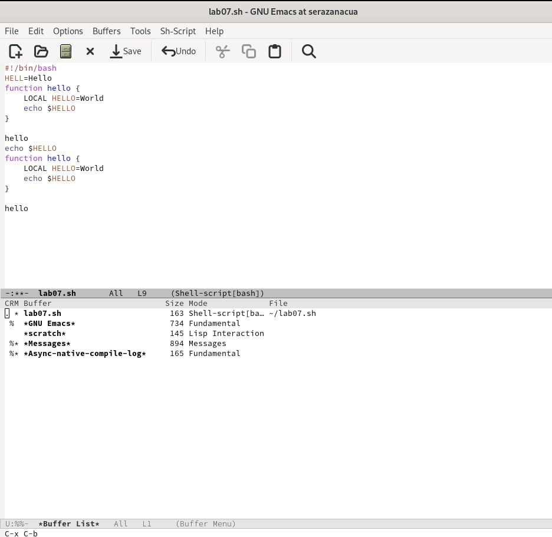

---
## Front matter
lang: ru-RU
title: Лабораторная работа № 11
subtitle: "Текстовой редактор emacs"
author: |
         Разанацуа Сара Естэлл
## i18n babel
babel-lang: russian
babel-otherlangs: english

## Formatting pdf
toc: false
toc-title: Содержание
slide_level: 2
aspectratio: 169
section-titles: true
theme: metropolis
header-includes:
 - \metroset{progressbar=frametitle,sectionpage=progressbar,numbering=fraction}
 - '\makeatletter'
 - '\beamer@ignorenonframefalse'
 - '\makeatother'
---
# Цель работы

- Познакомиться с операционной системой Linux. Получить практические навыки работы с редактором Emacs.

# Задание

1. Последовательность выполнения работы.

2. Основные команды emacs.

## Процесс выполнения

- Открыть emacs. 

{ #fig:001 width=50% }

## Процесс выполнения

- Создать файл lab07.sh с помощью комбинации Ctrl-x Ctrl-f (C-x C-f). 

{ #fig:002 width=50% }

##  Редактирование существующего файла

- Сохранить файл с помощью комбинации Ctrl-x Ctrl-s (C-x C-s). 

{ #fig:003 width=50% }

## Процесс выполнения

- Вырезать одной командой целую строку (С-k). 

{ #fig:004 width=50% }

## Процесс выполнения

- Вставить эту строку в конец файла (C-y). 

{ #fig:005 width=50% }

## Процесс выполнения

- Переместите курсор в начало строки (C-a). 

{ #fig:009 width=50% }

## Процесс выполнения

- Переместите курсор в конец строки (C-e). 

{ #fig:011 width=50% }

## Управление буферами

- Вывести список активных буферов на экран (C-x C-b).

{ #fig:013 width=50% }

## Процесс выполнения

- Закройте это окно (C-x 0).

{ #fig:012 width=50% }

## Процесс выполнения

- Поделите фрейм на 4 части: разделите фрейм на два окна по вертикали (C-x 3), а затем каждое из этих окон на две части по горизонтали (C-x 2) 

{ #fig:014 width=50% }

## Выводы

- В процессе выполнения лабораторной работы, я получила практические навыки работы в редакторе emacs.

## Список литературы

1. Командная строка Windows [Электронный ресурс]. URL:
https://foxford.ru/wiki/informatika/komandnaya-stroka-windows.

## {.standout}

Спасибо за внимания

