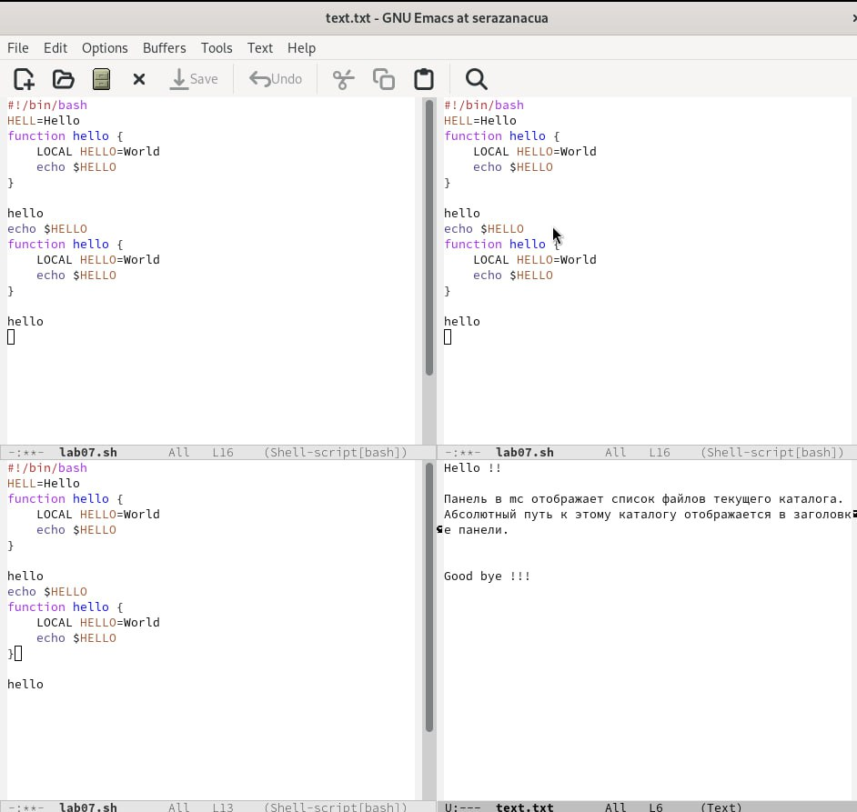

---
## Front matter
title: "Лабораторная работа № 11"
subtitle: "Текстовой редактор emacs"
author: "Разанацуа Сара Естэлл"

## Generic otions
lang: ru-RU
toc-title: "Содержание"

## Bibliography
bibliography: bib/cite.bib
csl: pandoc/csl/gost-r-7-0-5-2008-numeric.csl

## Pdf output format
toc: true # Table of contents
toc-depth: 2
lof: true # List of figures
lot: true # List of tables
fontsize: 12pt
linestretch: 1.5
papersize: a4
documentclass: scrreprt
## I18n polyglossia
polyglossia-lang:
  name: russian
  options:
	- spelling=modern
	- babelshorthands=true
polyglossia-otherlangs:
  name: english
## I18n babel
babel-lang: russian
babel-otherlangs: english
## Fonts
mainfont: PT Serif
romanfont: PT Serif
sansfont: PT Sans
monofont: PT Mono
mainfontoptions: Ligatures=TeX
romanfontoptions: Ligatures=TeX
sansfontoptions: Ligatures=TeX,Scale=MatchLowercase
monofontoptions: Scale=MatchLowercase,Scale=0.9
## Biblatex
biblatex: true
biblio-style: "gost-numeric"
biblatexoptions:
  - parentracker=true
  - backend=biber
  - hyperref=auto
  - language=auto
  - autolang=other*
  - citestyle=gost-numeric
## Pandoc-crossref LaTeX customization
figureTitle: "Рис."
tableTitle: "Таблица"
listingTitle: "Листинг"
lofTitle: "Список иллюстраций"
lotTitle: "Список таблиц"
lolTitle: "Листинги"
## Misc options
indent: true
header-includes:
  - \usepackage{indentfirst}
  - \usepackage{float} # keep figures where there are in the text
  - \floatplacement{figure}{H} # keep figures where there are in the text
---

# Цель работы

- Познакомиться с операционной системой Linux. Получить практические навыки работы с редактором Emacs.

# Задание

1. Последовательность выполнения работы.

2. Основные команды emacs.

# Выполнение лабораторной работы

- Открыть emacs. (рис. [-@fig:001])

{ #fig:001 width=70% }

- Создать файл lab07.sh с помощью комбинации Ctrl-x Ctrl-f (C-x C-f). (рис. [-@fig:002])

{ #fig:002 width=70% }

- Сохранить файл с помощью комбинации Ctrl-x Ctrl-s (C-x C-s). (рис. [-@fig:003])

{ #fig:003 width=70% }

## Проделать с текстом стандартные процедуры редактирования, каждое действие должно осуществляться комбинацией клавиш.

- Вырезать одной командой целую строку (С-k). (рис. [-@fig:004])

{ #fig:004 width=70% }

- Вставить эту строку в конец файла (C-y). (рис. [-@fig:005])

{ #fig:005 width=70% }

- Вставить область в конец файла. (рис. [-@fig:006])

{ #fig:006 width=70% }

- Вновь выделить эту область и на этот раз вырезать её (C-w). (рис. [-@fig:007])

{ #fig:007 width=70% }

- Отмените последнее действие (C-/). (рис. [-@fig:008])

{ #fig:008 width=70% }

## Научитесь использовать команды по перемещению курсора.

- Переместите курсор в начало строки (C-a). (рис. [-@fig:009])

{ #fig:009 width=70% }

- Переместите курсор в конец строки (C-e). (рис. [-@fig:011])

{ #fig:011 width=70% }

## Управление буферами

- Вывести список активных буферов на экран (C-x C-b). (рис. [-@fig:013])

{ #fig:013 width=70% }

- Закройте это окно (C-x 0).(рис. [-@fig:012])

{ #fig:012 width=70% }

## Управление окнами

- Поделите фрейм на 4 части: разделите фрейм на два окна по вертикали (C-x 3), а затем каждое из этих окон на две части по горизонтали (C-x 2) (рис. [-@fig:014])

{ #fig:014 width=70% }

- В каждом из четырёх созданных окон откройте новый буфер (файл) и введите несколько строк текста. (рис. [-@fig:015])

{ #fig:015 width=70% }

# Выводы

- В процессе выполнения лабораторной работы, я получила практические навыки работы в редакторе emacs.

# Список литературы{.unnumbered}

::: {#refs}
:::
