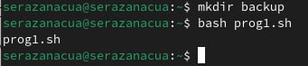
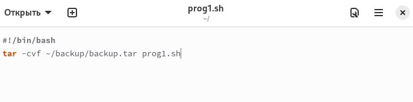
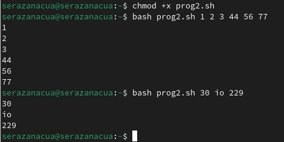
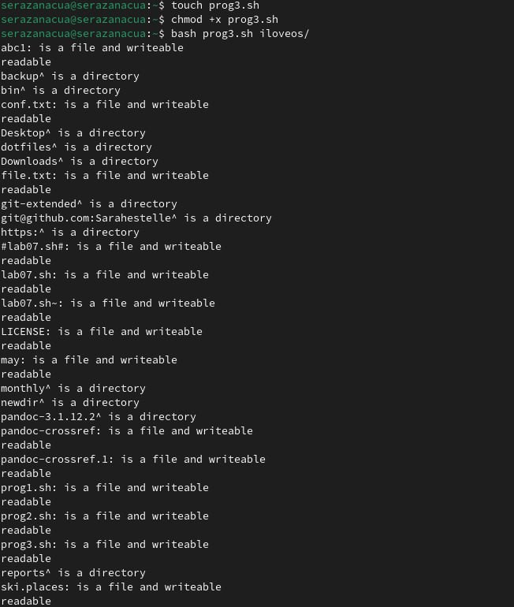
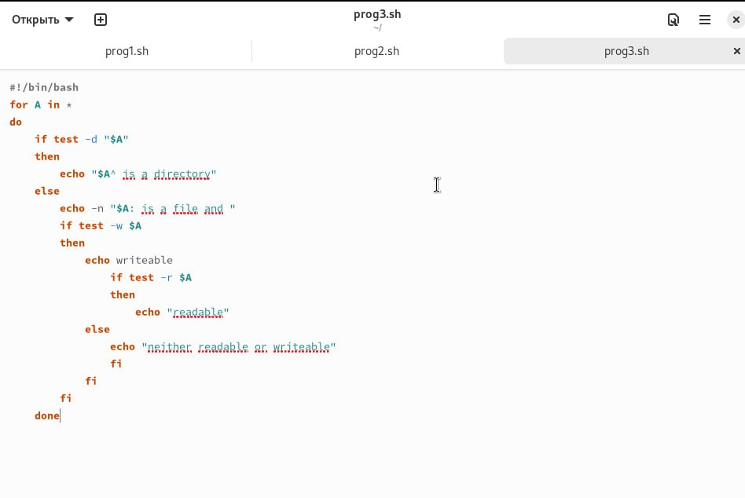
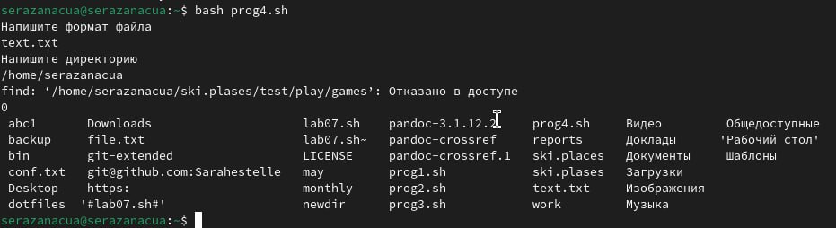

---
## Front matter
lang: ru-RU
title: Лабораторная работа № 12
subtitle: "ТПрограммирование в командном процессоре ОС UNIX. Командные файлы"
author: |
         Разанацуа Сара Естэлл
## i18n babel
babel-lang: russian
babel-otherlangs: english

## Formatting pdf
toc: false
toc-title: Содержание
slide_level: 2
aspectratio: 169
section-titles: true
theme: metropolis
header-includes:
 - \metroset{progressbar=frametitle,sectionpage=progressbar,numbering=fraction}
 - '\makeatletter'
 - '\beamer@ignorenonframefalse'
 - '\makeatother'
---
# Цель работы

- Изучить основы программирования в оболочке ОС UNIX/Linux. Научиться писать небольшие командные файлы.

## Процесс выполнения

- Создаю файл prog1.sh в котором буду пистаь программу с расширением sh (shell) с помощью утилиты touch, далее делаю его исполняемым с помощью chmod +x, открываю файл в любом текстовом редакторе, пишу в нем код, и после того как я написала программу в файле, я могу его запустить bash <имя командного файла> <аргументы> 

{#fig:001 width=50%}

## Процесс выполнения

- скрипт, который при запуске будет делать резервную копию самого себя в другую директорию backup в вашем домашнем каталоге. При этом файл должен архивироваться одним из архиваторов на выбор zip, bzip2 или tar 

{#fig:002 width=50%}

## Процесс выполнения

Создаю файл prog2.sh в котором буду пистаь программу с расширением sh (shell) с помощью утилиты touch, далее делаю его исполняемым с помощью chmod +x, открываю файл в любом текстовом редакторе, пишу в нем код, и после того как я написала программу в файле, я могу его запустить bash <имя командного файла> <аргументы>

{#fig:003 width=50%}

## Процесс выполнения

Пример командного файла, обрабатывающего любое произвольное число аргументов командной строки, в том числе превышающее десять. Например, скрипт может последовательно распечатывать значения всех переданных аргументов

{#fig:004 width=50%}

## Процесс выполнения

Создаю файл prog3.sh в котором буду пистаь программу с расширением sh (shell) с помощью утилиты touch, далее делаю его исполняемым с помощью chmod +x, открываю файл в любом текстовом редакторе, пишу в нем код, и после того как я написала программу в файле, я могу его запустить bash <имя командного файла> <аргументы>

{#fig:005 width=50%}

## Процесс выполнения

Командный файл — аналог команды ls (без использования самой этой команды и команды dir). Требуется, чтобы он выдавал информацию о нужном каталоге и выводил информацию о возможностях доступа к файлам этого каталога. 

{#fig:006 width=50%}

## Процесс выполнения

Создаю файл prog4.sh в котором буду пистаь программу с расширением sh (shell) с помощью утилиты touch, далее делаю его исполняемым с помощью chmod +x, открываю файл в любом текстовом редакторе, пишу в нем код 

{#fig:007 width=50%}

## Выводы

- При выполнении данной лабораторной работы я изучила основы программирования в оболочке ОС UNIX/Linux, научилась писать небольшие командные файлы.

## Список литературы

1. Командная строка Windows [Электронный ресурс]. URL:
https://foxford.ru/wiki/informatika/komandnaya-stroka-windows.

## {.standout}

Спасибо за внимания

