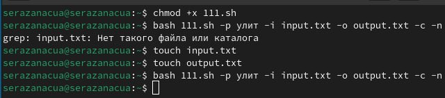

---
## Front matter
lang: ru-RU
title: Лабораторная работа № 13
subtitle: "Программирование в командном процессоре ОС UNIX. Ветвления и циклы"
author: |
         Разанацуа Сара Естэлл
## i18n babel
babel-lang: russian
babel-otherlangs: english

## Formatting pdf
toc: false
toc-title: Содержание
slide_level: 2
aspectratio: 169
section-titles: true
theme: metropolis
header-includes:
 - \metroset{progressbar=frametitle,sectionpage=progressbar,numbering=fraction}
 - '\makeatletter'
 - '\beamer@ignorenonframefalse'
 - '\makeatother'
---

# Цель работы

- Цель данной лабораторной работы - изучить основы программирования в оболочке ОС UNIX, научится писать более
сложные командные файлы с использованием логических управляющих конструкций и циклов.

## Процесс выполнения

- Создаю файл с разрешением на исполнение, а затем ищет в указанном файле нужные строки, определяемые ключом -p 

{#fig:001 width=50%}

{#fig:002 width=50%}

## Процесс выполнения

- Результат работы программы в файле output.txt.

{#fig:003 width=50%}

{#fig:004 width=50%}

## Процесс выполнения

- Создаю исполняемый файл для второй программы, также создаю файл 12.с для программы на Си. Пишу программу на языке Си, которая вводит число и определяет, является ли оно больше нуля, меньше нуля или равно нулю. Затем программа завершается с помощью функции exit(n), передавая информацию в о коде завершения в оболочку 

{#fig:005 width=50%}

## Процесс выполнения

- Командный файл должен вызывать эту программу и, проанализировав с помощью команды $?, выдать сообщение о том, какое число было введено.

{#fig:006 width=50%}

## Процесс выполнения

- Создаю исполняемый файл для третьей программы. Командный файл, создающий указанное число файлов, пронумерованных последовательно от 1 до N (например 1.tmp, 2.tmp, 3.tmp,4.tmp и т.д.). Число файлов, которые необходимо создать, передаётся в аргументы командной строки. Этот же командный файл должен уметь удалять все созданные им файлы (если они существуют) 

{#fig:008 width=50%}

## Процесс выполнения

- Проверяю, что программа создала файлы и удалила их при соответствующих запросах.

{#fig:009 width=50%}

## Процесс выполнения

- Создаю исполняемый файл для четвертой программы. Это командный файл, который с помощью команды tar запаковывает в архив все файлы в указанной директории. Модифицировать его так, чтобы запаковывались только те файлы, которые были изменены менее недели тому назад (использовать команду find).

{#fig:010 width=50%}

## Процесс выполнения

- Проверяю работу программы.

{#fig:011 width=50%}

# Выводы

- При выполнении данной лабораторной работы я изучила основы программирования в оболочке ОС UNIX, научилась писать более сложные командные файлы с использованием логических управляющих конструкций и циклов.

## Список литературы

1. Командная строка Windows [Электронный ресурс]. URL:
https://foxford.ru/wiki/informatika/komandnaya-stroka-windows.

## {.standout}

Спасибо за внимания

