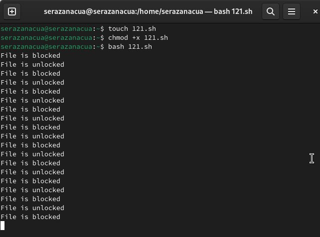
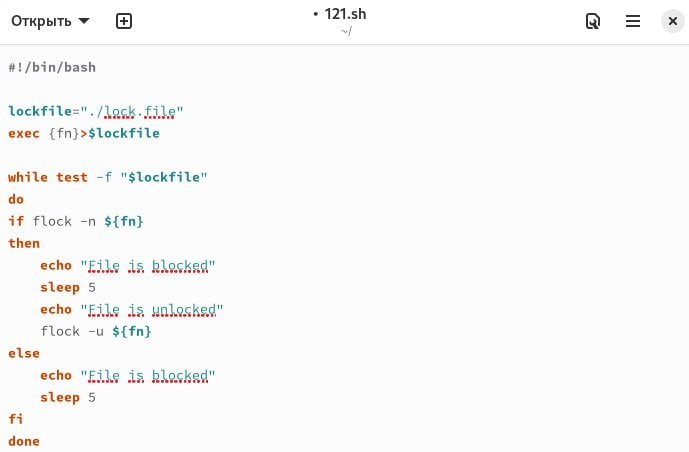
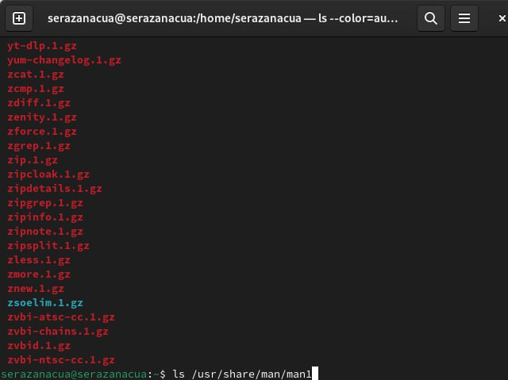
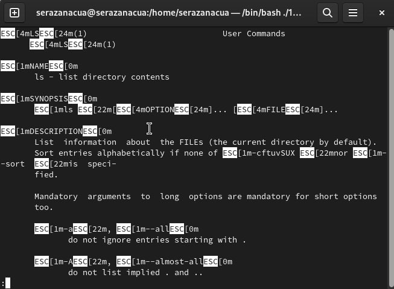
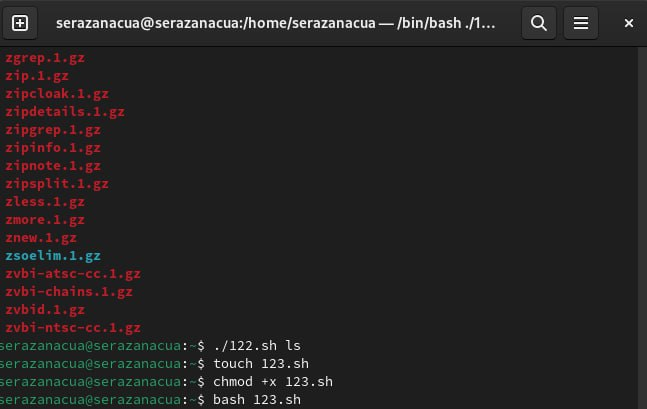
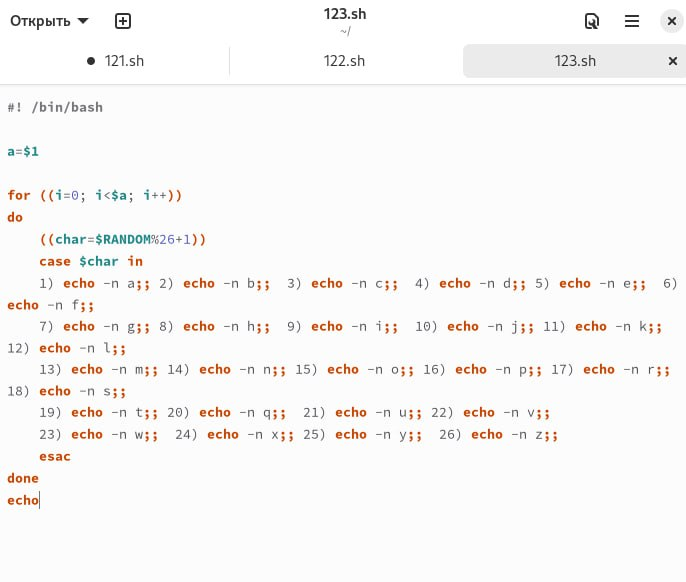

---
## Front matter
lang: ru-RU
title: Лабораторная работа № 14
subtitle: "Программирование в командном процессоре ОС UNIX. Расширенное программирование"
author: |
         Разанацуа Сара Естэлл
## i18n babel
babel-lang: russian
babel-otherlangs: english

## Formatting pdf
toc: false
toc-title: Содержание
slide_level: 2
aspectratio: 169
section-titles: true
theme: metropolis
header-includes:
 - \metroset{progressbar=frametitle,sectionpage=progressbar,numbering=fraction}
 - '\makeatletter'
 - '\beamer@ignorenonframefalse'
 - '\makeatother'
---

# Цель работы

- Цель данной лабораторной работы - изучить основы программирования в оболочке ОС UNIX, научиться писать более сложные командные файлы с использованием логических управляющих конструкций и циклов.

## Процесс выполнения

- Создаю командный файл для первой программы, пишу ее, проверяю ее работу.

{#fig:001 width=50%}

## Процесс выполнения

- Командный файл, реализующий упрощённый механизм семафоров. Командный файл должен в течение некоторого времени t1 дожидаться освобождения ресурса, выдавая об этом сообщение, а дождавшись его освобождения, использовать его в течение некоторого времени t2<>t1, также выдавая информацию о том, что ресурс используется соответствующим командным файлом (процессом). Запустить командный файл в одном виртуальном терминале в фоновом режиме, перенаправив его вывод в другой, в котором также запущен этот файл, но не фоновом, а в привилегированном режиме. Доработать программу так, чтобы имелась возможность взаимодействия трёх
и более процессов.

{#fig:002 width=50%}

## Процесс выполнения

- Чтобы реализовать команду man с помощью командного файла, изучаю содержимое каталога /usr/share/man/man1. В нем находятся архивы текстовых файлов, содержащих справку по большинству установленных в системе программ и команд. Каждый архив можно открыть командой less сразу же просмотрев содержимое справки.

{#fig:003 width=50%}

## Процесс выполнения

- Командный файл должен получать в виде аргумента командной строки название команды и в виде результата выдавать справку об этой команде или сообщение об отсутствии справки, если соответствующего файла нет в каталоге man1.

{#fig:004 width=50%}

## Процесс выполнения

- Командный файл работает так же, как и команда man, открывает справку по указанной утилите.

{#fig:005 width=50%}

- Создаю файл для кода третьей программы, пишу программу и проверяю ее работу.

{#fig:006 width=50%}

## Процесс выполнения

- Используя встроенную переменную $RANDOM, пишу командный файл, генерирующий случайную последовательность букв латинского алфавита. Т.к. $RANDOM выдаёт псевдослучайные числа в диапазоне от 0 до 32767, ввожу ограничения так, чтобы была генерация чисел от 1 до 26.

{#fig:007 width=50%}

## Выводы

- При выполнении данной лабораторной работы я изучила основы программирования в оболочке ОС UNIX, научилась писать более сложные командные файлы с использованием логических управляющих конструкций и циклов.

## Список литературы

1. Командная строка Windows [Электронный ресурс]. URL:
https://foxford.ru/wiki/informatika/komandnaya-stroka-windows.

## {.standout}

Спасибо за внимания

