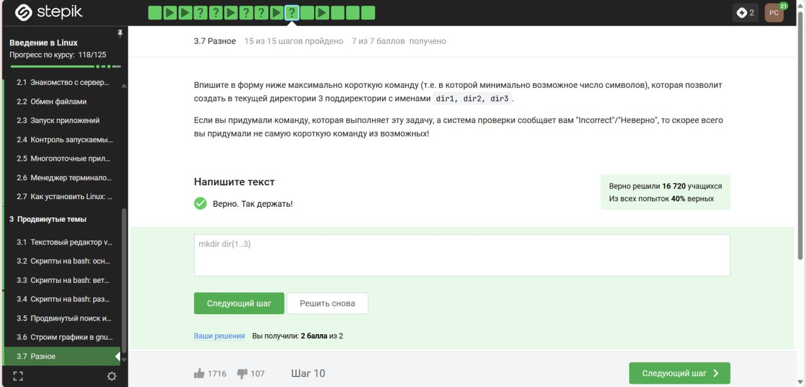

---
## Front matter
title: "Отчет о прохождении 3 этапа внешних курсов"
subtitle: "Продвинутые темы"
author: "Разанацуа Сара Естэлл, НКАбд-05-23"

## Generic otions
lang: ru-RU
toc-title: "Содержание"

## Bibliography
bibliography: bib/cite.bib
csl: pandoc/csl/gost-r-7-0-5-2008-numeric.csl

## Pdf output format
toc: true # Table of contents
toc-depth: 2
lof: true # List of figures
lot: true # List of tables
fontsize: 12pt
linestretch: 1.5
papersize: a4
documentclass: scrreprt
## I18n polyglossia
polyglossia-lang:
  name: russian
  options:
	- spelling=modern
	- babelshorthands=true
polyglossia-otherlangs:
  name: english
## I18n babel
babel-lang: russian
babel-otherlangs: english
## Fonts
mainfont: PT Serif
romanfont: PT Serif
sansfont: PT Sans
monofont: PT Mono
mainfontoptions: Ligatures=TeX
romanfontoptions: Ligatures=TeX
sansfontoptions: Ligatures=TeX,Scale=MatchLowercase
monofontoptions: Scale=MatchLowercase,Scale=0.9
## Biblatex
biblatex: true
biblio-style: "gost-numeric"
biblatexoptions:
  - parentracker=true
  - backend=biber
  - hyperref=auto
  - language=auto
  - autolang=other*
  - citestyle=gost-numeric
## Pandoc-crossref LaTeX customization
figureTitle: "Рис."
tableTitle: "Таблица"
listingTitle: "Листинг"
lofTitle: "Список иллюстраций"
lotTitle: "Список таблиц"
lolTitle: "Листинги"
## Misc options
indent: true
header-includes:
  - \usepackage{indentfirst}
  - \usepackage{float} # keep figures where there are in the text
  - \floatplacement{figure}{H} # keep figures where there are in the text
---

# Цель работы

Ознакомиться с функционалом операционной системы Linux.

# Задание

Просмотреть видео и на основе полученной информации пройти тестовые задания.

# Теоретическое введение

Линукс - в части случаев GNU/Linux — семейство Unix-подобных операционных систем на базе ядра Linux, включающих тот или иной набор утилит и программ проекта GNU, и, возможно, другие компоненты. Как и ядро Linux, системы на его основе, как правило, создаются и распространяются в соответствии с моделью разработки свободного и открытого программного обеспечения. Linux-системы распространяются в основном бесплатно в виде различных дистрибутивов — в форме, готовой для установки и удобной для сопровождения и обновлений, — и имеющих свой набор системных и прикладных компонентов, как свободных, так и проприетарных. 

# Выполнение лабораторной работы

3 Этап: 

{#fig:080 width=70%}

Текущий каталог - это depth=1, а остальное считается просто:

/home/bi   -> depth=1

/home/bi/dir1   -> depth=2

/home/bi/dir1/dir2   -> depth=3


{#fig:081 width=70%}

Из описания man:
Print NUM lines of trailing context after/before matching lines
"matching lines" - множественное число, строки в которых нашлось совпадение

Т.е. если идут 2...10...100 строк подряд, в которых обнаружилось совпадение, контекст будет выведен до и после этой ГРУППЫ строк, а не до и после каждой строки в этой группе

{#fig:082 width=70%}


Объяснение на втором скриншоте.

{#fig:083 width=70%}

The -n option disables the automatic printing, which means the lines you don't specifically tell it to print do not get printed, and lines you do explicitly tell it to print (e.g. with p) get printed only once. 


{#fig:084 width=70%}

аббревиатура ABBA отличается от двух других аббревиатур тем, что справа он неё стоит запятая без пробела: "ABBA,". 

При этом по условию аббревиатура должна выглядеть как [ XX ] или [ XXX ] (и ещё больше X). Следовательно, для этой проверки надо добавить пробел квадратными скобками [ ] слева и, соответственно, с права.


{#fig:085 width=70%}

-persist lets plot windows survive after main gnuplot program exits. 


{#fig:086 width=70%}

`plot 'data.csv' using 1:2` даст ошибку:

`warning: Skipping data file with no valid points ^ x range is invalid`

Скорее всего причиной такого поведения является тот факт, что формат CSV содержит строки, где столбцы разделены запятой? Содержимое файла:

```
1,21
2,22
3,23
4,24
5,25
6,26
7,27
8,28
9,29
10,30
```

{#fig:087 width=70%}

Cначала идет команда установки подписей, а потом в скобках:

подпись - пробел - переменная с координатой - запятая

Повторяется это количество раз соответствующее числу переменных, и без запятой (в случае с последней переменной)

А подпись в свою очередь получается конкатенацией текста из задания и переменной с координатой.

{#fig:088 width=70%}

1. График строится строкой "splot x**2+y**2". 
2. Вращение задается строкой "zrot=(zrot+10)%360". Значит, смещение вперед (которое было изначально) можно также задать строкой "zrot=(zrot+360+10)%360" или иначе говоря "zrot=(zrot+370)%360". А теперь посмотрим на наше требование - чтоб вращалось в другую сторону, значит, по аналогии, необходимо вместо перебора на 10 сделать недобор. 

"zrot=(zrot+350)%360"

3. Строка "pause 0.2" ставит выполнение на паузу на определенный промежуток времени. В задании сказали перерисовывать чаще, значит пауза должна быть меньше.

{#fig:089 width=70%}


# Сертификат

{#fig:090 width=70%}


# Выводы

Я просмотрела курс и освежила в памяти навыки работы с более сложными командами в Линукс.

# Список литературы{.unnumbered}

1. Введение в Linux

::: {#refs}
:::

