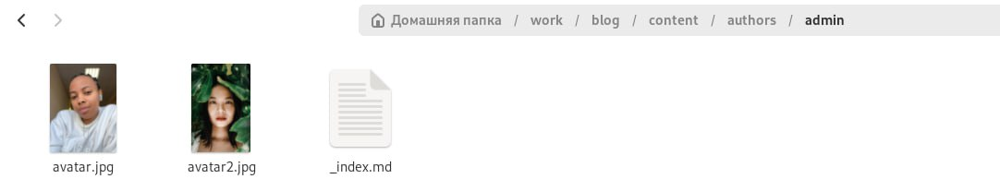
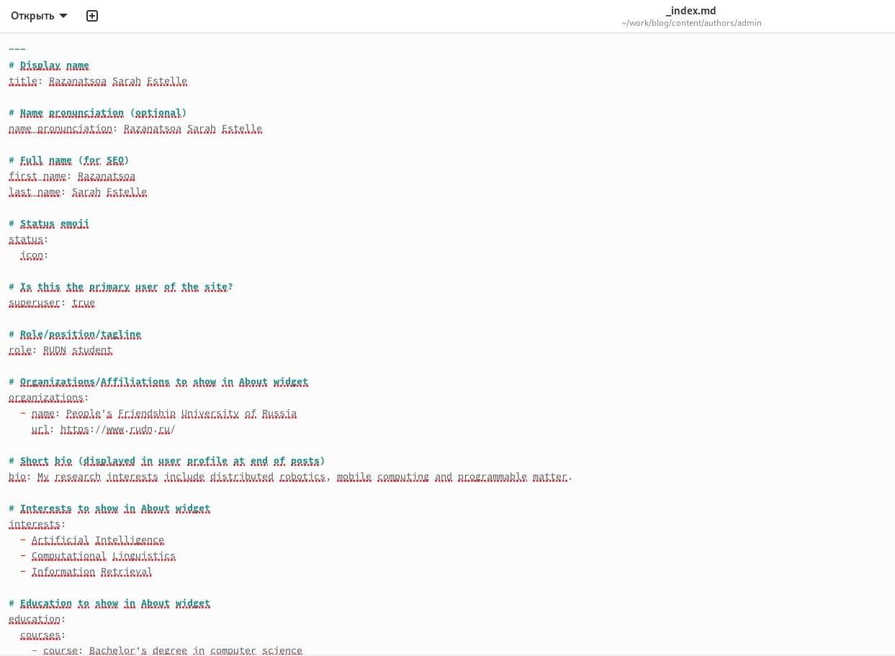
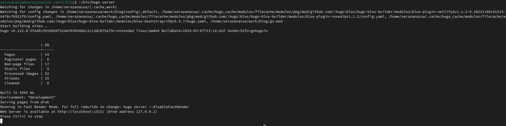
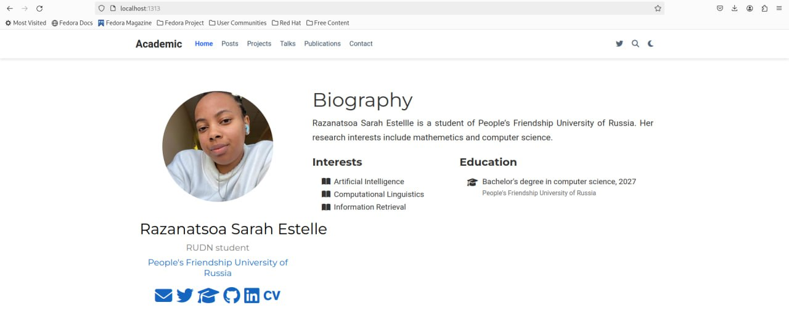
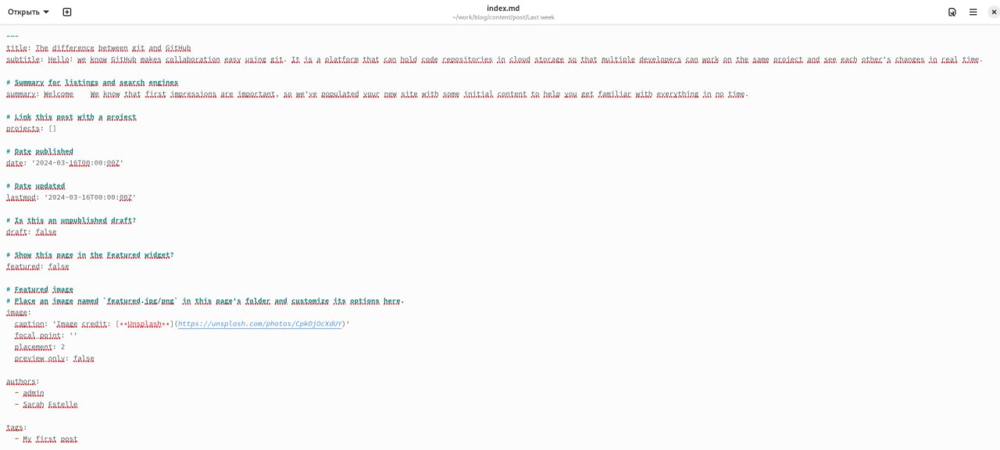
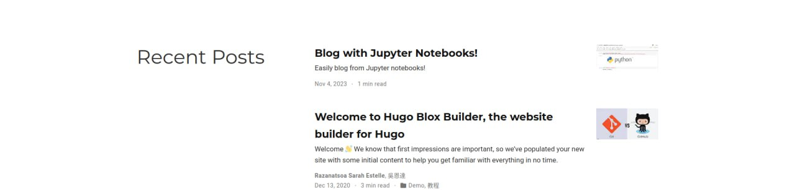

---
## Front matter
lang: ru-RU
title: Второй этап индивидуального проекта
subtitle: Создание сайт
author: |
         Разанацуа Сара Естэлл
## i18n babel
babel-lang: russian
babel-otherlangs: english

## Formatting pdf
toc: false
toc-title: Содержание
slide_level: 2
aspectratio: 169
section-titles: true
theme: metropolis
header-includes:
 - \metroset{progressbar=frametitle,sectionpage=progressbar,numbering=fraction}
 - '\makeatletter'
 - '\beamer@ignorenonframefalse'
 - '\makeatother'
---

## Цель

- Продолжить работы со своим сайтом. Редактировать его в соответствие с требованиями. Добавить данные о себе на сайт. 

## Основные задачи

- сохраните фото в файл ~/work/blog/content/authors/admin 

{#fig:001 width=100%}

- Разместим краткое описание владельца сайта (Biography). Добавим информацию об интересах (Interests). Добавим информацию от образовании (Education). 

{#fig:002 width=100%}

- Переходим на сайт с помощью команды  ~/bin/hugo server 

{#fig:003 width=100%}

{#fig:004 width=100%}

- Сделаем пост по прошедшей неделе. Добавим пост на тему по выбору: Управление версиями. Git. Непрерывная интеграция и непрерывное развертывание (CI/CD). 

{#fig:005 width=100%}

{#fig:006 width=100%}

## Вывод

- В процесс выполнении второго этапа индивидуального проекта, я научилась редактировать данные о себе, а также писать посты и добавлять их на сайт.

## Список литературы

1. Командная строка Windows [Электронный ресурс]. URL:
https://foxford.ru/wiki/informatika/komandnaya-stroka-windows.

## {.standout}

Спасибо за внимания

