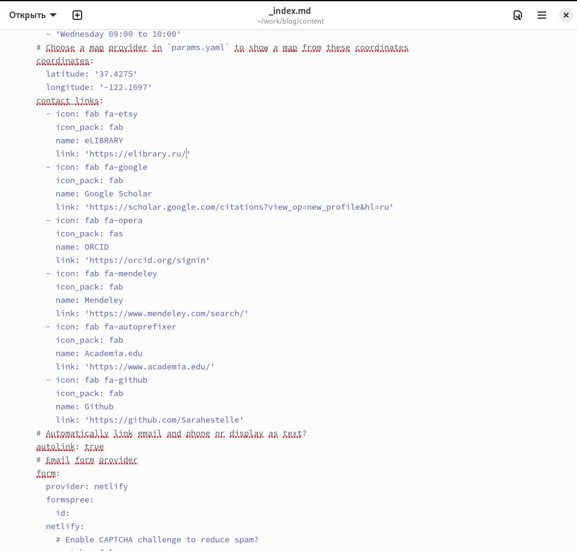
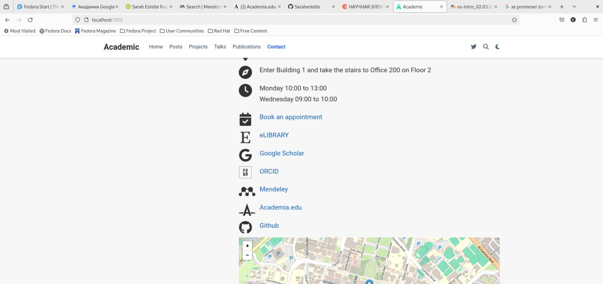
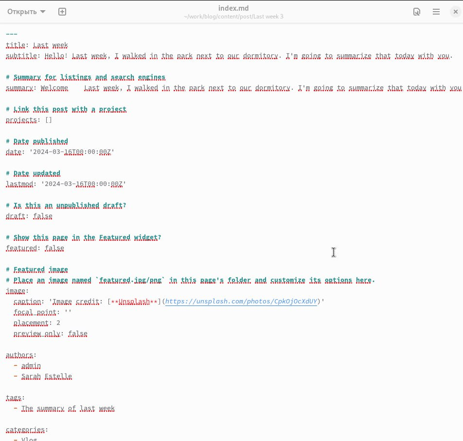
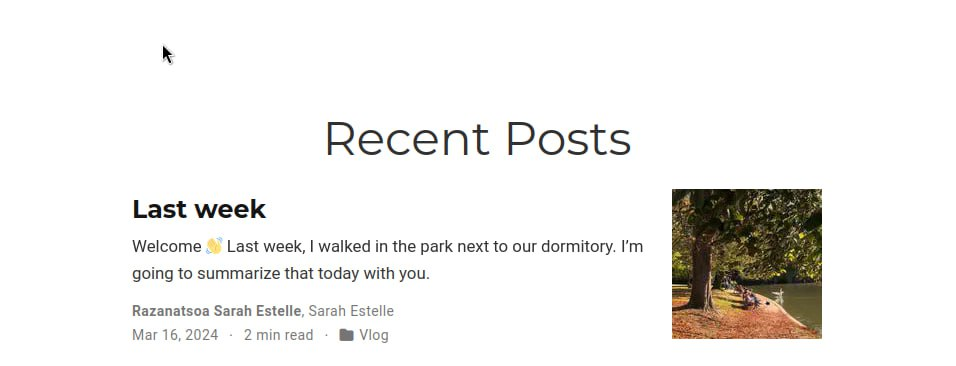
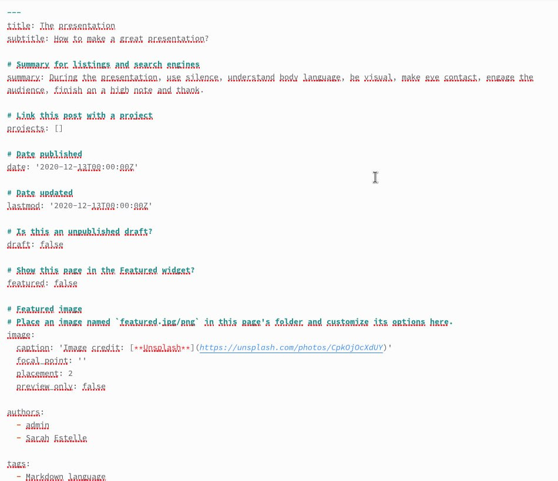
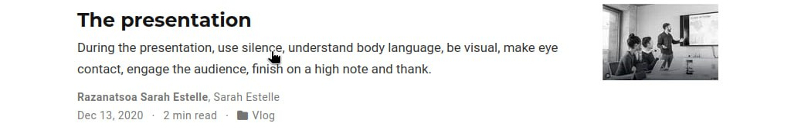

---
## Front matter
lang: ru-RU
title:  Четвертый этап индивидуального проекта
subtitle: Операционные системы
author:
  - Разанацуа Сара Естэлл
institute:
  - Российский университет дружбы народов, Москва, Россия
  - 
date: 26 Апрель 2024

## i18n babel
babel-lang: russian
babel-otherlangs: english

## Formatting pdf
toc: false
toc-title: Содержание
slide_level: 2
aspectratio: 169
section-titles: true
theme: metropolis
header-includes:
 - \metroset{progressbar=frametitle,sectionpage=progressbar,numbering=fraction}
 - '\makeatletter'
 - '\beamer@ignorenonframefalse'
 - '\makeatother'
---

## Цель работы

- Продолжить редактирование своего сайта. Добавить ссылки на научные ресурсы.

## Задание

1. Зарегистрироваться на соответствующих ресурсах и разместить на них ссылки на сайте.
2. Сделать пост по прошедшей неделе.
3. Добавить пост на тему по выбору:

- Оформление отчёта.
- Создание презентаций.
- Работа с библиографией.

## Выполнение проекта

- Зарегистрируемся на соответствующих ресурсах и разместим на них ссылки на сайте. 

{#fig:001 width=50%}

## Выполнение проекта

- Результат на сайт.

{#fig:002 width=50%}

## Выполнение проекта

- Сделаем пост по прошедшей неделе. 

{#fig:003 width=50%}

## Выполнение проекта

- Результат на сайт.

{#fig:004 width=50%}

## Выполнение проекта

- Добавить пост на тему по выбору создания презентаций. 

{#fig:005 width=50%}

## Выполнение проекта

- Результат на сайт. 

{#fig:006 width=50%}

## Выводы

- В процессе выполнения этого этапа проекта я добавила на сайт ссылки на свои научные аккаунты, а также написала два  поста. 

## Список литературы

1. Что такое сайт (простыми словами)l [Электронный ресурс]. URL: https: //uguide.ru/chto-takoe-sajt-prostymi-slovami.

## {.standout}

Спасибо за внимание

