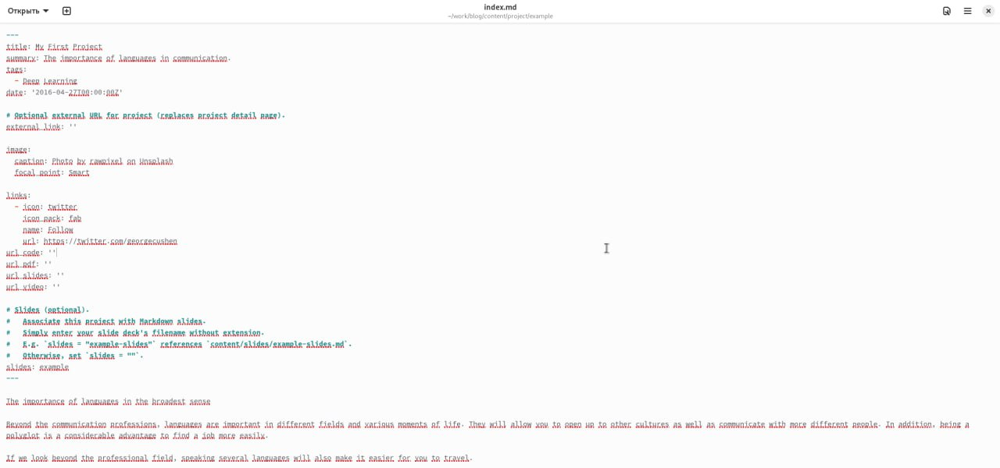
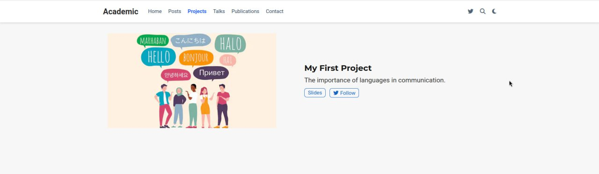
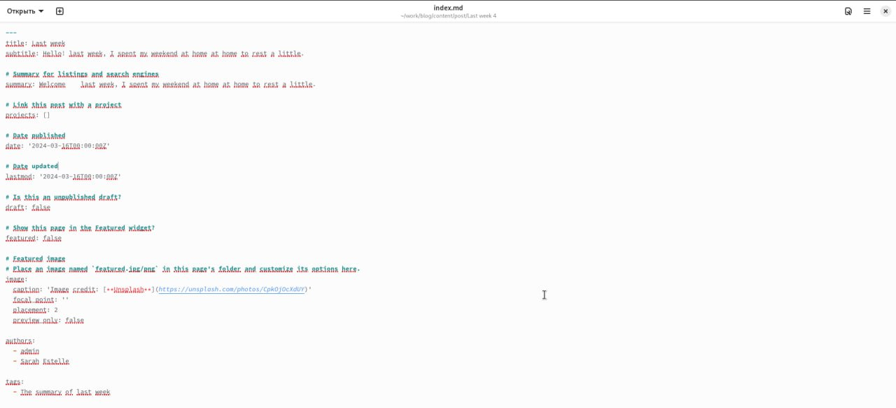
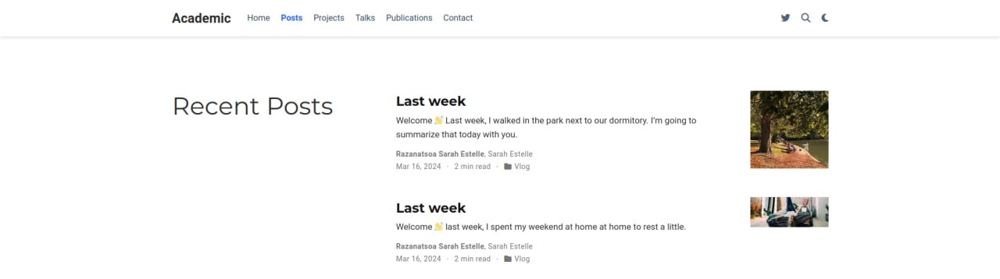
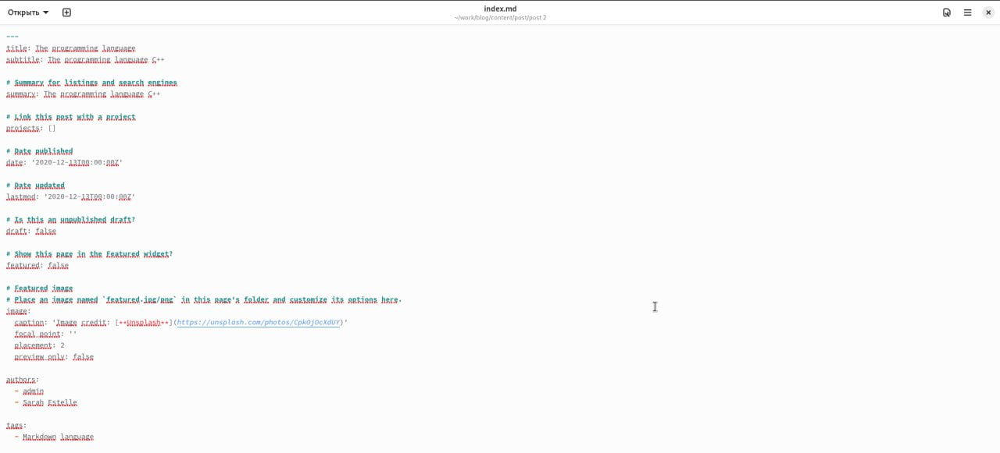
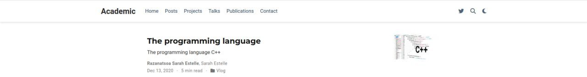

---
## Front matter
lang: ru-RU
title:  Пятый этап индивидуального проекта
subtitle: Операционные системы
author:
  - Разанацуа Сара Естэлл
institute:
  - Российский университет дружбы народов, Москва, Россия
  - 
date: 26 Апрель 2024

## i18n babel
babel-lang: russian
babel-otherlangs: english

## Formatting pdf
toc: false
toc-title: Содержание
slide_level: 2
aspectratio: 169
section-titles: true
theme: metropolis
header-includes:
 - \metroset{progressbar=frametitle,sectionpage=progressbar,numbering=fraction}
 - '\makeatletter'
 - '\beamer@ignorenonframefalse'
 - '\makeatother'
---

## Цель работы

- Добавить с сайту все остальные элементы.

## Задание

1. Сделать записи для персональных проектов.
2. Сделать пост по прошедшей неделе.
3. Добавить пост на тему по выбору.

- Языки научного программирования.

## Выполнение проекта

1. Сделаем записи для персональных проектов. 

{ #fig:001 width=50% }

{ #fig:002 width=50% }

## Выполнение проекта

2. Сделаем пост по прошедшей неделе. 

{ #fig:003 width=50% }

{ #fig:004 width=50% }

## Выполнение проекта

3. Добавим пост на тему языки научного программирования. 

{ #fig:005 width=50% }

{ #fig:006 width=50% }

## Выводы

- В процессе выполнения этого этапа индивидуального проекта я продолжила редактирование своего научного сайта. Научилась добавлять записи для персональных проектов.

## Список литературы

1. Что такое сайт (простыми словами)l [Электронный ресурс]. URL: https: //uguide.ru/chto-takoe-sajt-prostymi-slovami.

## {.standout}

Спасибо за внимание

